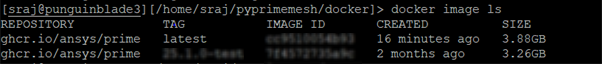

.. _ref_index_getting_started:

===============
Getting started
===============

PyPrimeMesh is a Python client for Ansys Prime Server,
which provides core Ansys meshing technology.

To use PyPrimeMesh, you must have a local installation of Ansys 2023 R1 or later.
The Ansys version that you have installed dictates the features available to you.

For more information on getting a licensed copy of Ansys, visit the `Ansys website <https://www.ansys.com/>`_.

.. note::
   The PyPrimeMesh client release has one-to-one compatibility with the Ansys Prime Server release.
   That is, the PyPrimeMesh client is only compatible with its corresponding Ansys Prime Server.

This table provides compatibility information:

+----------------------------+----------------------------+--------------------------+
| PyPrimeMesh client release | Ansys Prime Server release |Supported python versions |
+============================+============================+==========================+
| 0.2.x                      | 23.1.0 (2023 R1)           | 3.7 to 3.11              |
|                            |                            |                          |
| 0.3.x                      | 23.1.1 (2023 R1 SP1)       | 3.7 to 3.11              |
|                            |                            |                          |
| 0.4.x                      | 23.2.0 (2023 R2)           | 3.8 to 3.11              |
|                            |                            |                          |
| 0.5.x                      | 24.1.0 (2024 R1)           | 3.8 to 3.11              |
|                            |                            |                          |
| 0.6.x                      | 24.2.0 (2024 R2)           | 3.8 to 3.11              |
|                            |                            |                          |
| 0.7.x                      | 25.1.0 (2025 R1)           | 3.10 to 3.12             |
+----------------------------+----------------------------+--------------------------+

Installation
------------

The ``ansys-meshing-prime`` package currently supports Python 3.10
to Python 3.12 on the Windows and Linux operating systems.

You can install PyPrimeMesh with all dependencies directly from `PyPI <https://pypi.org/>`_  with this command:

.. code-block::

   pip install ansys-meshing-prime[all]

Alternatively, you can clone this repository and install the client using these commands:

.. code-block::

   git clone https://github.com/ansys/pyprimemesh
   cd pyprimemesh
   pip install -e .[all]

The preceding commands install all features that are important to development.
To install a basic version of the client, use this command instead:

.. code-block::

   pip install -e .

Dependencies
------------

You must have Ansys 2023 R1 or later installed to have access to Ansys Prime
Server. Optionally, CAD readers can be configured. 

Ansys Prime Server requires one of the following licenses to run. The system
checks out the first available license from the list in the following order:

1.  CFD PrepPost
2.  CFD PrepPost Pro
3.  Mechanical Enterprise PrepPost
4.  Mechanical Enterprise
5.  Mechanical Pro
6.  Mechanical Premium
7.  Ansys LS-DYNA

Launch PyPrimeMesh
------------------

To launch PyPrimeMesh, use this code:

.. code-block:: python

   import ansys.meshing.prime as prime

   with prime.launch_prime() as prime_client:
       model = prime_client.model

Launching PyPrimeMesh through docker
------------------------------------

Ansys Prime Server is capable of being launched through docker. 
Docker is an open platform for developing, shipping, and running apps in a containerized way.
Containers are standard units of software that package the code and all its dependencies.
Hence, the app runs quickly and reliably from one computing environment to another.

Ansys Prime Server can be built as a Linux Docker container.
Hence, you should have a linux machine to run the Ansys Prime Server.

Docker for Linux containers
~~~~~~~~~~~~~~~~~~~~~~~~~~~~
To run the Linux Docker container for the Ansys Prime Server, 
ensure that you follow these steps when installing the Docker:

1.	Install `Docker Engine <https://docs.docker.com/engine/install/rhel/>`_.

2.	Restart your machine and start Docker Engine after completing the installation.

Your Docker engine supports running Linux Docker containers, you can build or install the Ansys Prime Server image.

.. note::
Ansys Prime Server uses Intel MPI library for performing meshing operations. Intel MPI library requires NUMA support.
Docker desktop allows to run linux containers on windows using WSL. Existing Linux distributions used for WSL do not typically support NUMA.
It is expected that a custom Linux distribution would be required for WSL to run the Ansys Prime Server container to support NUMA.
Ansys does not recommend you to run the Ansys Prime Server image without NUMA support.

Build or install the Ansys Prime Server image
~~~~~~~~~~~~~~~~~~~~~~~~~~~~~~~~~~~~~~~~~~~~~~~~

You can install the Ansys Prime Server image in the following ways:

•	Download it from the GitHub Container Registry.

•	Build the Ansys Prime Server Linux container.

GitHub container registry
^^^^^^^^^^^^^^^^^^^^^^^^^

.. note::
You should have write access to the repository or should be a members of the Ansys organization.

After installing Docker on your machine, follow these steps to download the Linux Docker container
for the Ansys Prime Server and install this image.

1.	Download the Docker image from the `PyPrimeMesh repository <https://github.com/ansys/pyprimemesh>`_ on GitHub using your GitHub credentials.
2.	Use a GitHub personal access token with permission for reading packages to authorize Docker to access the PyPrimeMesh repository. For more information, see `Managing your personal access tokens <https://docs.github.com/en/authentication/keeping-your-account-and-data-     secure/managing-your-personal-access-tokens>`_ in the GitHub documentation.
3.	Save the token to a file using this command:

   .. code-block:: pycon

      echo XXXXXXXXXXXXXXXXXXXXXXXXXXXXXXXXXXXXXXXX > GH_TOKEN.txt

4.	Authorize Docker to access the repository and run the commands for your OS. 

   **Linux:**

      .. code-block:: pycon
         
         setenv GH_USERNAME <your_github_username>
         cat GH_TOKEN.txt | docker login ghcr.io -u $GH_USERNAME --password-stdin

5.	Pull the Ansys Prime Server locally using Docker using the following command:

   .. code-block:: pycon

        docker pull ghcr.io/ansys/prime:25.1.0

Build the Ansys Prime Server linux container
^^^^^^^^^^^^^^^^^^^^^^^^^^^^^^^^^^^^^^^^^^^^^^   

You can build the Ansys Prime Server Docker containers from the PyPrimeMesh repository docker folder.
The docker folder has the linux/Dockerfile that builds the Linux-based Docker image.

.. note::
   Ansys Prime Server does not support building windows-based docker images.

You can build the docker image file as follows: 

•	**Build from available Ansys installation**: Builds the Docker image using the Ansys installation available in the machine where the Docker image is being built.

Prerequisites
''''''''''''''

Ensure that Docker is installed in your machine. If you do not have Docker available, see :ref:`Docker for Linux containers <Docker for Linux containers>`.

Build from available Ansys installation
''''''''''''''''''''''''''''''''''''''''

To build your own image from your Ansys installation, follow these instructions:

1. Go to the Docker folder in your local PyPrimeMesh repository.

2.	Execute the script with the following command (no specific location needed):

  .. code-block:: pycon

     python build_docker_linux.py <ANSYS_INSTALLATION_PATH>

For example,

   .. code-block:: pycon

      $AWP_ROOT251/commonfiles/CPython/3_10/linx64/Release/python/bin/python  build_docker_linux.py $AWP_ROOT251

3. Check that the image has been created successfully. 

You can view the docker image created with latest tag as follows:

Launch the Ansys Prime Server
''''''''''''''''''''''''''''''

Ansys Prime Server can be launched using the PyPrimeMesh launcher.
You should set the following mandatory environment variable for launching the Ansys Prime Server:

- PYPRIMEMESH_LAUNCH_CONTAINER: Launches the Ansys Prime Server form the PyPrimeMesh container.

- PYPRIMEMESH_IMAGE_TAG: Latest version of the Ansys Prime Server docker image.

- ANSYSLMD_LICENSE_FILE: License server required for launching the Ansys Prime Server.

Setting the environment variable
'''''''''''''''''''''''''''''''''

Define the following general environment variables prior to using the Ansys Prime Server launcher. 

**Linux**

   .. code-block:: pycon

      export PYPRIMEMESH_LAUNCH_CONTAINER=1
      export PYPRIMEMESH_IMAGE_TAG=<latest>
      export ANSYSLMD_LICENSE_FILE=<valid license server>

.. note::
   Docker image creation is supported from 2025 R1 version.

Launching Ansys Prime Server 
''''''''''''''''''''''''''''''

Ansys Prime Server can be launched as follows:

.. code-block:: pycon

   >>> from ansys.meshing import prime
   >>> client = prime.launch_prime()
   >>> model = client.model

