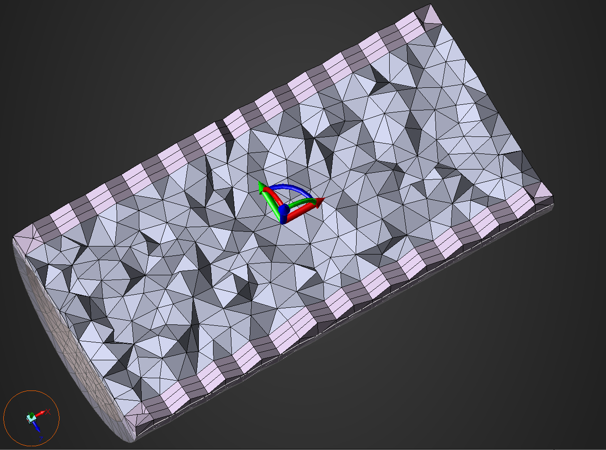

.. _ref_index_automesh:

******************
Volumetric meshing
******************

The :class:`AutoMesh <ansys.meshing.prime.AutoMesh>` class enables you to
automatically create the volume mesh using different volume meshing algorithms. This class
generates the volume mesh for all computed volumetric regions of the mesh object.
For example, it creates mesh objects from the imported geometry. The
:func:`AutoMesh.mesh() <ansys.meshing.prime.AutoMesh.mesh>` method allows you to perform
volumetric meshing with given meshing parameters.

.. note::
   The starting point for the volumetric meshing procedure is a valid surface mesh.

.. tip::
    Volume mesh can be generated using the :func:`Mesh.volume_mesh() <ansys.meshing.prime.lucid.Mesh.volume_mesh>`
    method in the Lucid API.

=============================
Second-order tetrahedral mesh
=============================

This code shows how to initialize the :class:`AutoMeshParams<ansys.meshing.prime.AutoMeshParams>` class
and generate the volume mesh on meshed TopoFaces:

.. code-block:: python

   automesh_params = prime.AutoMeshParams(
       model=model,
       max_size=1.0,
       volume_fill_type=prime.VolumeFillType.TET,
       tet=prime.TetParams(model=model, quadratic=True),
   )

This code prints the automatic mesh parameters so that you can review them:

.. code-block:: pycon

   >>> print(automesh_params)

   size_field_type :  SizeFieldType.GEOMETRIC
   max_size :  1.0
   prism_control_ids :  []
   volume_fill_type :  VolumeFillType.TET
   prism :  { no_imprint_zonelets :  [] }
   tet :  { quadratic :  True }
   volume_control_ids :  []

This code generates the volume mesh:

.. code-block:: python

   prime.AutoMesh(model).mesh(part_id=part.id, automesh_params=automesh_params)

==================================
Prism controls for polyhedral mesh
==================================

The :class:`PrismControl <ansys.meshing.prime.PrismControl>` class helps you to control prism mesh generation
based on the face scope, volume scope and growth rate. You can use one or more prism controls. Each prism control
definition is applied to one or more boundary zones and affects the height distribution and number of layers of
the prism cells in the adjacent boundary layers.  

This example shows how to perform these steps:

* Create the prism control and specify the boundary layer setting.
* Perform volume meshing with polyhedral elements.
* Check volume mesh quality based on cell quality measures. For more information, see :ref:`ref_index_mesh_diagnostics`.

.. code-block:: python

   # Prism control
   prism_control = model.control_data.create_prism_control()
   face_scope = prime.ScopeDefinition(
       model=model,
       entity_type=prime.ScopeEntity.FACEZONELETS,
       label_expression="* !inlet !outlet",
   )
   volume_scope = prime.ScopeDefinition(
       model=model, entity_type=prime.ScopeEntity.VOLUME, label_expression="*"
   )
   prism_control.set_surface_scope(face_scope)
   prism_control.set_volume_scope(volume_scope)
   prism_control.set_growth_params(prime.PrismControlGrowthParams(model=model))

   # Volume mesh with polyhedral elements
   automesh_params = prime.AutoMeshParams(
       model=model,
       volume_fill_type=prime.VolumeFillType.POLY,
       prism_control_ids=[prism_control.id],
   )
   prime.AutoMesh(model).mesh(part_id=part.id, automesh_params=automesh_params)

   # Volume search to check volume mesh quality
   search = prime.VolumeSearch(model=model)
   qual_params = prime.VolumeQualitySummaryParams(
       model=model,
       cell_quality_measures=[prime.CellQualityMeasure.SKEWNESS],
       quality_limit=[0.95],
   )
   qual_summary_res = search.get_volume_quality_summary(params=qual_params)

This code prints the volume quality summary:

.. code-block:: pycon

    >>> print(qual_summary_res)

    error_code :  ErrorCode.NOERROR
    quality_results_part :  [
    cell_quality_measure :  CellQualityMeasure.SKEWNESS
    measure_name :  Skewness
    part_id :  2
    quality_limit :  0.95
    n_found :  0
    max_quality :  0.795889
    min_quality :  0.00163176]
    message :  Skewness
        Part ID: flow_volume
        Quality Limit: 0.95
            Number of failures: 0
            Max Skew: 0.795889
            Min Skew: 0.00163176
    Summary Results:
        Number of failures: 0
        Max Skew: 0.795889
        Min Skew: 0.00163176

Prism controls for polyhedral mesh using the Lucid module
---------------------------------------------------------

This example shows how to generate the preceding poly prism method using the Lucid module:

.. code-block:: python

    # Volume mesh with polyhedral elements
    # Set prism layers parameter for boundary layer refinement
    mesh_util.volume_mesh(
        volume_fill_type=prime.VolumeFillType.POLY,
        prism_layers=5,
        prism_surface_expression="* !inlet !outlet",
    )

=============================
Volume-specific mesh controls
=============================

The :class:`VolumeControl <ansys.meshing.prime.VolumeControl>` class helps you to control volume mesh zonelets and elements.
Volume mesh zonelets include fluids, solid, and dead. Elements include tetrahedrons and polyhedrons. This class
allows you to define the scope and generate the various types of volume mesh.

This example shows how to perform these steps:

* Create volume control and set zone-specific parameters.
* Perform volume meshing with tetrahedral elements.

.. code-block:: python

   # Volume control
   volume_control = model.control_data.create_volume_control()
   volume_scope = prime.ScopeDefinition(
       model=model, evaluation_type=prime.ScopeEvaluationType.ZONES, zone_expression="*"
   )
   volume_control.set_scope(volume_scope)
   volume_control.set_params(
       prime.VolumeControlParams(
           model=model, cell_zonelet_type=prime.CellZoneletType.FLUID
       )
   )

   # Volume mesh
   automesh_params = prime.AutoMeshParams(
       model=model,
       size_field_type=prime.SizeFieldType.VOLUMETRIC,
       volume_fill_type=prime.VolumeFillType.TET,
       volume_control_ids=[volume_control.id],
   )
   prime.AutoMesh(model).mesh(part_id=part.id, automesh_params=automesh_params)

=========================
Thin volume mesh controls
=========================

The :class:`ThinVolumeControl <ansys.meshing.prime.ThinVolumeControl>` class creates prisms from a source face mesh projecting to a target with the specified number of layers. 

.. note::
    Thin volume controls can only be applied on the meshed surfaces.

Some guidelines for the thin volume mesh controls: 

 - Source and target face zonelets should not be the same. 
 - The number of prism layers to be created between source and target must be greater than zero. 
 - A source face zonelet cannot be a target face zonelet in a subsequent control. 
 - A source can only belong to two thin volume controls. 
 - Always choose the one with most features as the source. 
 - Target face zonelets cannot be adjacent to regions with cells whereas source face zonelets can. 
 - Sides of the new thin volume control cannot be adjacent to regions with existing cells. 
 - Sides of one thin volume control can only be a source to another thin volume control. 

The below example shows how to: 

* Create a thin volume control and set source and target. 
* Set the thin volume mesh parameters and perform volume meshing.

.. code-block:: python

    part = model.get_part_by_name("pipe")
    thin_vol_ctrls_ids = []
    thin_vol_ctrl = model.control_data.create_thin_volume_control()
    thin_vol_ctrl.set_source_scope(
        prime.ScopeDefinition(model, label_expression="thin_src")
    )
    thin_vol_ctrl.set_target_scope(
        prime.ScopeDefinition(model, label_expression="thin_trg")
    )
    thin_vol_ctrl.set_thin_volume_mesh_params(
        prime.ThinVolumeMeshParams(
            model=model,
            n_layers=3,
        )
    )
    thin_vol_ctrls_ids.append(thin_vol_ctrl.id)

    # Volume mesh
    auto_mesh_params = prime.AutoMeshParams(
        model=model,
        thin_volume_control_ids=thin_vol_ctrls_ids,
    )
    prime.AutoMesh(model).mesh(part.id, auto_mesh_params)

Layers of thin volume mesh created between the source and target surfaces.

