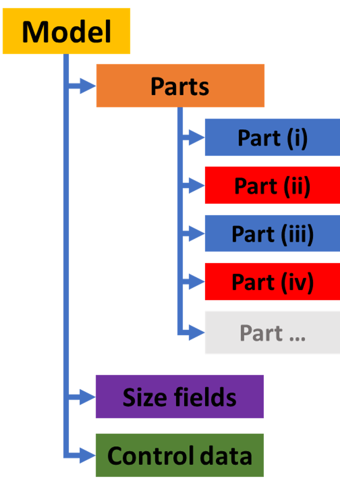
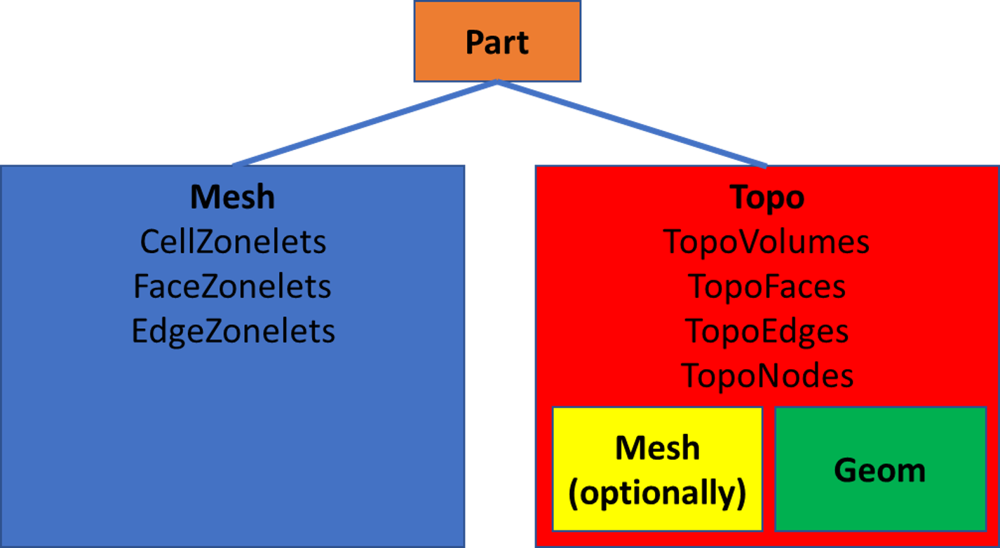
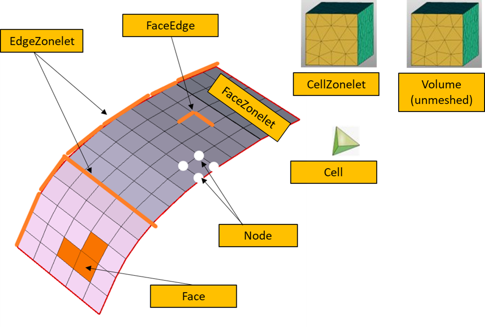

.. _ref_index_concepts:

****************************
Concepts and model structure
****************************

=====
Model
=====

The :class:`Model <ansys.meshing.prime.Model>` class is the top-level container for PyPrimeMesh.
It contains all information about the PyPrimeMesh session.  

    **Model structure**

This code shows how the :class:`Model <ansys.meshing.prime.Model>` class is accessed from the
:class:`Client <ansys.meshing.prime.Client>` class:

.. code-block:: python

    import ansys.meshing.prime as prime

    prime_client = prime.launch_prime()
    model = prime_client.model

This code imports a CAD file containing a single part:

.. code-block:: python

    cad_file = prime.examples.download_elbow_scdoc()
    params = prime.ImportCadParams(model)
    prime.FileIO(model).import_cad(file_name=cad_file, params=params)

The code prints the :class:`Model <ansys.meshing.prime.Model>` class to obtain a summary
of the current session:

.. code-block:: pycon

    >>> print(model)

	Part Summary:

	Part Name: flow_volume
	Part ID: 2
		13 Topo Edges
		9 Topo Faces
		1 Topo Volumes

		0 Edge Zones
			Edge Zone Name(s) : []
		0 Face Zones
			Face Zone Name(s) : []
		1 Volume Zones
			Volume Zone Name(s) : [volume]

		2 Label(s)
			Names: [inlet, outlet]

		Bounding box (-203.2 -228.6 -50.8)
					 (203.2 203.2 50.8)

=====
Parts
=====

Geometry topology and mesh data in the :class:`Model <ansys.meshing.prime.Model>` class is stored
within any number of :attr:`parts <ansys.meshing.prime.Model.parts>` parameters:

.. code-block:: python

    model.parts

Each :class:`Part <ansys.meshing.prime.Part>` class can contain *TopoEntities* or *zonelets*.
TopoEntities are *TopoParts* created from CAD geometry imports. Zonelets are mesh parts created
from faceted geometry and mesh imports. TopoEntities and zonelets are characterized by the
dimension of entities.

    **Part types**

------------
TopoEntities
------------

TopoEntities are created from importing a CAD geometry and represent connectivity information.
TopoEntities have geometric representation that can be defined by splines or facets. The mesh
generated on TopoEntities are projected on the geometry representation.

There are four types of TopoEntities:

- TopoNode: TopoEntity representing points
- TopoEdge: TopoEntity representing curves
- TopoFace: TopoEntity representing surfaces
- TopoVolume: TopoEntity representing volumes

.. figure:: ../images/TopoEntities.png
    :width: 400pt
    :align: center

    **TopoEntities schematic**

--------
Zonelets
--------

Zonelets are created from importing mesh files and are groups of interconnected entities in a mesh.

There are three types of zonelets:

- FaceZonelet: A group of interconnected faces
- EdgeZonelet: A group of interconnected edges
- CellZonelet: A group of interconnected cells

A *volume* is a set of face zonelets that define a closed volume without containing any cell elements.

    **Zonelets schematic**

-----
Zones
-----

Zonelets or TopoEntities can be further grouped into zones. A zonelet or TopoEntity can only be present in a single zone.

When exporting a mesh (MSH or CAS) file to the Fluent solver, you should define the boundary conditions for the zones.

When importing a Fluent solver model, each zone is defined as a single zonelet.

------
Labels
------

Labels allow overlapping groups of zonelets or TopoEntities.

When importing CAD files, each group or named selection generates a label.

When exporting to a Mechanical solver (CDB) file, each label is exported as a component.
