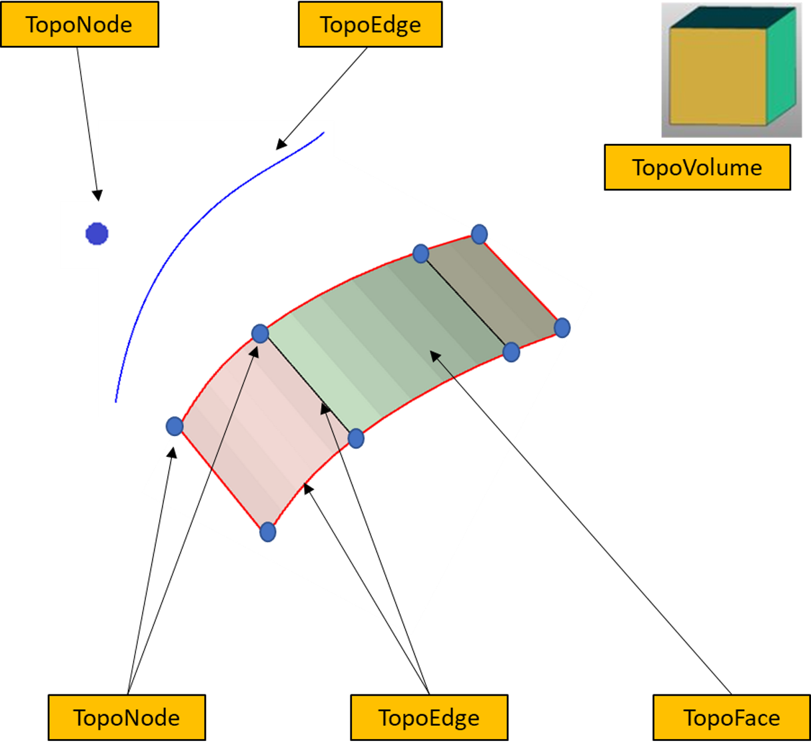
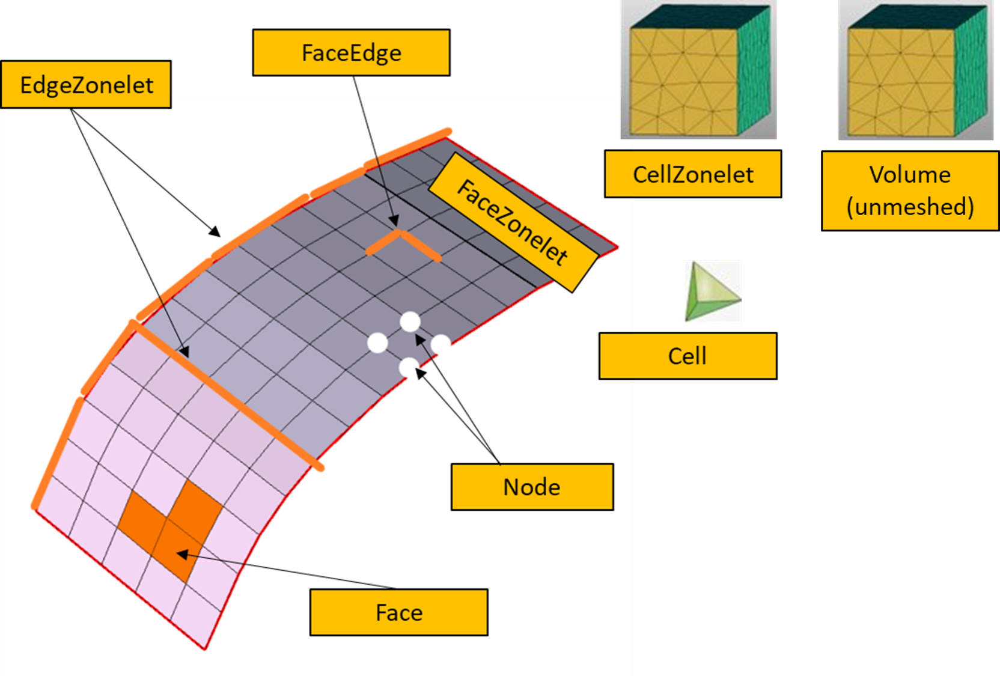

.. _ref_index_concepts:

*****************************
Concepts and Model Structure
*****************************

------
Model 
------

The :class:`Model <ansys.meshing.prime.Model>` class is the top-level container for Prime. It contains all information about the Prime session.  

The :class:`Model <ansys.meshing.prime.Model>` is accessed from the :class:`Client <ansys.meshing.prime.Client>` class as follows:
  
.. code:: python

    >>> import ansys.meshing.prime as prime
    >>> prime_client = prime.launch_prime()
    >>> model = prime_client.model

:class:`Model <ansys.meshing.prime.Model>` can be printed to give a summary of the current session.
  
.. code:: python

    >>> print(model)

------
Parts 
------

Geometry topology and mesh data in the :class:`Model <ansys.meshing.prime.Model>` is stored within any number of :attr:`parts <ansys.meshing.prime.Model.parts>`.

.. code:: python

    >>> model.parts

Each :class:`part <ansys.meshing.prime.Model.Part>` can contain TopoEntities and Zonelets.
  
TopoEntities and Zonelets are characterized by dimension of entities.
  
TopoEntities
------------

TopoEntities represent connectivity information.  TopoEntities have geometric representation which may be defined by splines or facets.
The mesh generated on TopoEntities will be projected on geometry representation.  There are four types of TopoEntities. They are:
  
    * TopoNode: TopoEntity representing points.
    * TopoEdge: TopoEntity representing curves.
    * TopoFace: TopoEntity representing surfaces.
    * TopoVolume: TopoEntity representing volumes.

    **TopoEntities**
  
Zonelets
--------

Zonelets are a group of interconnected elements in a mesh. There are three types of Zonelets. They are:

    * FaceZonelet: A group of interconnected face elements.
    * EdgeZonelet: A group of interconnected edge elements.
    * CellZonelet: A group of interconnected cell elements.
  
A set of FaceZonelets that define a closed volume without containing any cell elements is defined as a Volume.

    **Zonelets**
  
  Zones
  -----
  
  Labels
  ------
  
