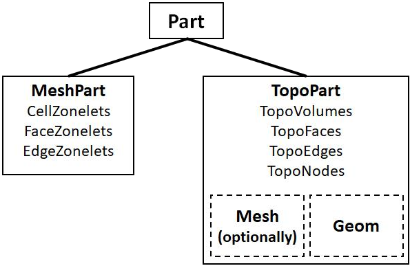

.. _ref_index_concepts:

*****************************
Concepts and Model Structure
*****************************

------
Model 
------

The :class:`Model <ansys.meshing.prime.Model>` class is the top-level container for PyPrime. It contains all information about the PyPrime session.  

.. figure:: ../images/model_structure.png
    :width: 200pt
    :align: center

    **Model structure**
    
The :class:`Model <ansys.meshing.prime.Model>` is accessed from the :class:`Client <ansys.meshing.prime.Client>` class as follows:
  
.. code:: python

    >>> import ansys.meshing.prime as prime
    >>> prime_client = prime.launch_prime()
    >>> model = prime_client.model

:class:`Model <ansys.meshing.prime.Model>` can be printed to give a summary of the current session.
  
.. code:: python

    >>> print(model)
    
    Part Summary:
    
An example output for a CAD file containing a single part is shown below:

.. code:: python

    >>> cad_file = prime.examples.download_elbow_scdoc()
    >>> params = prime.ImportCadParams(model)
    >>> prime.FileIO(model).import_cad(file_name=cad_file, params=params)
    
    >>> print(model)
    
	Part Summary:

	Part Name: flow_volume
	Part ID: 2
		13 Topo Edges
		9 Topo Faces
		1 Topo Volumes

		0 Edge Zones
			Edge Zone Name(s) : []
		0 Face Zones
			Face Zone Name(s) : []
		1 Volume Zones
			Volume Zone Name(s) : [volume]

		2 Label(s)
			Names: [inlet, outlet]

		Bounding box (-203.2 -228.6 -50.8)
					 (203.2 203.2 50.8)    
        
    
------
Parts 
------

Geometry topology and mesh data in the :class:`Model <ansys.meshing.prime.Model>` is stored within any number of :attr:`parts <ansys.meshing.prime.Model.parts>`.

.. code:: python

    >>> model.parts

Each :class:`Part <ansys.meshing.prime.Part>` can contain either TopoEntities (TopoPart created from CAD geometry import) 
or Zonelets (MeshPart created from faceted geometry and mesh import).

    **Part types**
  
TopoEntities and Zonelets are characterized by dimension of entities.
  
TopoEntities
------------

TopoEntities are created from importing CAD and represent connectivity information.  TopoEntities have geometric representation 
which may be defined by splines or facets.  The mesh generated on TopoEntities will be projected on geometry representation.  

There are four types of TopoEntities:
  
    * TopoNode: TopoEntity representing points.
    * TopoEdge: TopoEntity representing curves.
    * TopoFace: TopoEntity representing surfaces.
    * TopoVolume: TopoEntity representing volumes.

.. figure:: ../images/topo.png
    :width: 400pt
    :align: center

    **TopoEntities schematic**
  
Zonelets
--------

Zonelets are created from importing mesh files and are groups of interconnected elements in a mesh. 

There are three types of Zonelets:

    * FaceZonelet: A group of interconnected face elements.
    * EdgeZonelet: A group of interconnected edge elements.
    * CellZonelet: A group of interconnected cell elements.
  
A set of FaceZonelets that define a closed volume without containing any cell elements is defined as a Volume.

.. figure:: ../images/zonelets.png
    :width: 400pt
    :align: center

    **Zonelets schematic**

-----
Zones
-----

Zonelets or TopoEntities can be further grouped into zones.  A Zonelet or TopoEntity can only be present in a single zone.  

In order to export a mesh to the Fluent solver (.msh, .cas) zones are required to define boundary conditions.  

When importing a Fluent solver model each zone will be defined as a single zonelet.

------
Labels
------

Labels allow overlapping groups of Zonelets or TopoEntities.  

When importing CAD files each group or named selection will generate a label.  

When exporting to a mechanical solver file (.cdb) each label is exported as a collection.
