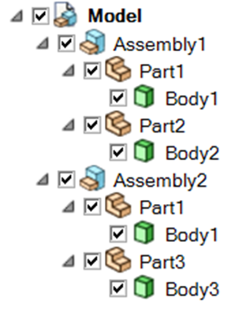
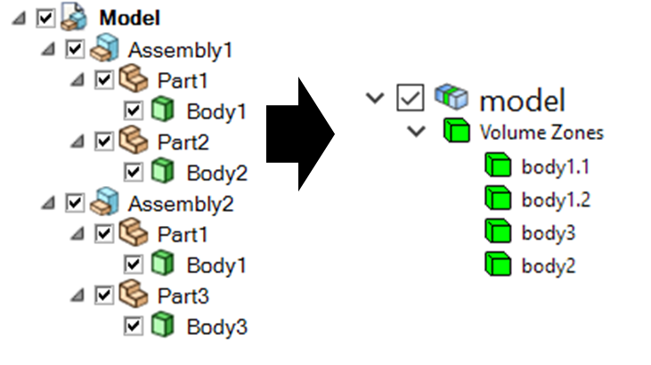
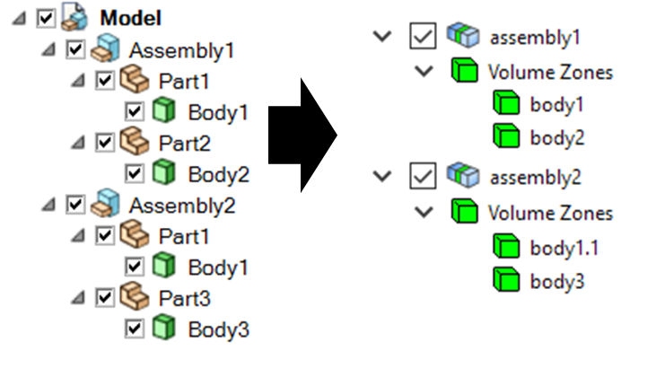
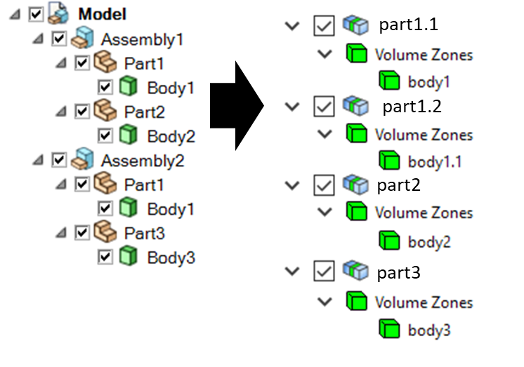
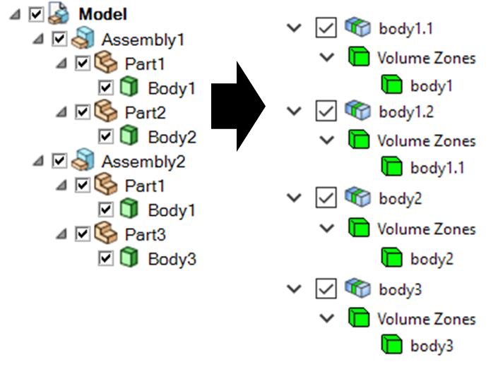

.. _ref_index_reading_writing:


*************************
Reading and writing files
*************************

The :class:`FileIO <ansys.meshing.prime.FileIO>` class is used for all file-based data exchanges.


===================
Native PMDAT format
===================

PMDAT is the native file format for PyPrimeMesh. It contains all data associated with the active model.

This includes geometry, mesh, topology, controls, labels, and zones.

The model data can be read from and written to the PMDAT format using the
:func:`FileIO.read_pmdat() <ansys.meshing.prime.FileIO.read_pmdat>` and
:func:`FileIO.write_pmdat() <ansys.meshing.prime.FileIO.write_pmdat>` methods
with parameters defined in the :class:`FileReadParams <ansys.meshing.prime.FileReadParams>`
and :class:`FileWriteParams <ansys.meshing.prime.FileWriteParams>` classes respectively.

.. code-block:: python

    from ansys.meshing import prime

    # Start Ansys Prime Server and get the model
    prime_client = prime.launch_prime()
    model = prime_client.model

    # Download and read an example PMDAT file
    mixing_elbow = prime.examples.download_elbow_pmdat()
    params = prime.FileReadParams(model=model)
    prime.FileIO(model).read_pmdat(file_name=mixing_elbow, file_read_params=params)

.. tip::
    Files can be read or imported based on file extension using the :func:`Mesh.read() <ansys.meshing.prime.lucid.Mesh.read>`
    method in the Lucid API. The method supports PyPrimeMesh's native format, various CAD formats, and solver mesh files. 


================
Import CAD files
================

The :func:`FileIO.import_cad() <ansys.meshing.prime.FileIO.import_cad>` method allows
you to import CAD files and set parameters for importing files using the
:class:`ImportCadParams <ansys.meshing.prime.ImportCadParams>` class.  


CAD reader routes
-----------------

You can specify the import route for CAD files using the :class:`CadReaderRoute <ansys.meshing.prime.CadReaderRoute>` class.

.. code-block:: python

    params = prime.ImportCadParams(
        model=model, cad_reader_route=prime.CadReaderRoute.DISCOVERY
    )
    prime.FileIO(model).import_cad(file_name=mixing_elbow, params=params)

Alternatively, you can use the :class:`Mesh <ansys.meshing.prime.lucid.Mesh>` class in the Lucid API:

.. code-block:: python

    mesh_util = prime.lucid.Mesh(model=model)
    mesh_util.read(file_name=mixing_elbow, cad_reader_route=prime.CadReaderRoute.DISCOVERY)

Four CAD import routes are available in PyPrimeMesh:

 * ``Program controlled``: Chooses the CAD reader route based on the extension of the provided CAD file as follows:

   - Native for FMD, X_T, X_B, JT, PLMXML, and STL
   - Discovery for DSCO, SCDOC and SCDOCX
   - Workbench for all other extensions

 * ``Native``: Natively supported file format extensions are FMD,
   Parasolid (X_T and X_B), JTOpen (JT and PLMXML), and STL.

 * ``SpaceClaim``: Uses SpaceClaim to import supported CAD files from the SpaceClaim reader. Only the
   Windows platform supports importing files using the SpaceClaim reader. Ensure to install 
   SpaceClaim for SpaceClaim reader.

 * ``Discovery``: Uses Discovery to import supported CAD files from the Discovery reader. Only the
   Windows platform supports importing files using the Discovery reader.
   Ensure to install Discovery for Discovery reader. 

 ..note:
```suggestion
      When you import CAD using the SpaceClaim or Discovery reader routes the user import options in those
      applications are ignored.
      If the options are required then you can import CAD in the application stand-alone with the options defined and
      export it to a native format (FMD or PMDB) to import into Ansys Prime Server.

 * ``Workbench``: Uses Workbench to import supported CAD files from the Workbench reader.
     Ensure to install Workbench for Workbench reader. 
    
To view the CAD files supported for the Workbench route on different platforms, see
`CAD Support <https://www.ansys.com/it-solutions/platform-support>`_ on the Ansys website. 

.. note::
    * Program controlled supports faceted data. Workbench supports BRep geometry(non-faceted) data. 
      Discovery or SpaceClaim supports both BRep geometry and faceted data.

    * When deploying scripts using the Workbench CAD reader route, ensure that the user options for the installed
       application are consistent in the deployed environment.
    * When deploying scripts using the CAD configuration, ensure that the configuration is consistent in the deployed
      environment.

    * You must install and configure Workbench CAD readers or plug-ins (Ansys Geometry Interfaces)
      while installing Ansys Workbench.

    * To preserve shared topology, the Workbench CAD reader route must be used.

    * Patterned name selections are not supported for the SpaceClaim or Discovery CAD reader routes.
      To import patterned named selections, the Workbench CAD reader route can be used.


Append CAD files
----------------

The :attr:`ImportCadParams.append <ansys.meshing.prime.ImportCadParams.append>` parameter allows
you to append a CAD file to the model: 

.. code-block:: python

    params = prime.ImportCadParams(model=model, append=True)
    prime.FileIO(model).import_cad(file_name="cad_to_append.dsco", params=params)

Alternatively, you can use the :class:`Mesh <ansys.meshing.prime.lucid.Mesh>` class in
the Lucid API:

.. code-block:: python

    mesh_util = prime.lucid.Mesh(model=model)
    mesh_util.read("cad_to_append.dsco", append=True)

Parametric CAD update
---------------------

Parametric CAD update can be used while importing CAD files that have parameters defined that
can be accessed by Workbench CAD readers.  

This code gets existing CAD parameters while importing:

.. code-block:: python

    params = prime.ImportCadParams(model=model)
    params.cad_reader_route = prime.CadReaderRoute.WORKBENCH
    result = prime.FileIO(model).import_cad(file_name="parametric_cad.dsco", params=params)

.. code-block:: pycon

    >>> print(result.cad_parameters)

    {'my_param': 1}

This code sets the parameters that are used for the import:

.. code-block:: python

    params = prime.ImportCadParams(model=model)
    params.cad_reader_route = prime.CadReaderRoute.WORKBENCH
    params.cad_update_parameters = {"my_param": 2}
    result = prime.FileIO(model).import_cad(file_name="parametric_cad.dsco", params=params)

.. code-block:: pycon

    >>> print(result.cad_parameters)

    {'my_param': 2}


Part management and creation
----------------------------

PyPrimeMesh has options for part management within the product structure while importing a CAD (Computer Aided Design) model. 
The CAD model is the top in product hierarchy. A CAD model can have one or more CAD assemblies. The CAD assembly or
subassembly has different CAD parts. The CAD part has bodies or other geometric entities. Here is a typical CAD product
structure from SpaceClaim:



    **Example CAD structure from SpaceClaim**

The :class:`PartCreationType <ansys.meshing.prime.PartCreationType>` class decides whether to create a part per:

 * Model

 * Assembly

 * Part

 * Body


Model
^^^^^

When you import a CAD model and specify the :class:`PartCreationType <ansys.meshing.prime.PartCreationType>` parameter
as :attr:`MODEL <ansys.meshing.prime.PartCreationType.MODEL>`, a single part is created that inherits its name from
the CAD model name. The number of zones within the part is identical to the number of bodies within the CAD model.



    **Part creation by model (from SpaceClaim to PyPrimeMesh part structure)**

Assembly
^^^^^^^^

When you import a CAD model and specify the :class:`PartCreationType <ansys.meshing.prime.PartCreationType>` parameter
as :attr:`ASSEMBLY <ansys.meshing.prime.PartCreationType.ASSEMBLY>`, a part per CAD assembly is created where the part
name is inherited from the CAD assembly name. The number of zones within each part is identical to the number of bodies
within the CAD assembly.



    **Part creation by assembly (from SpaceClaim to PyPrimeMesh part structure)**

Part
^^^^

When you import a CAD model and specify the :class:`PartCreationType <ansys.meshing.prime.PartCreationType>` parameter
as :attr:`PART <ansys.meshing.prime.PartCreationType.PART>`, a part per CAD part is created that inherits the part
name from the CAD part name. The number of zones within a part is identical to the number of bodies within the CAD
part.



    **Part creation by part (from SpaceClaim to PyPrimeMesh part structure)**

Body
^^^^

When you import a CAD model and specify the :class:`PartCreationType <ansys.meshing.prime.PartCreationType>` parameter
as :attr:`BODY <ansys.meshing.prime.PartCreationType.BODY>`, a part per CAD body is created that inherits the part name
from the CAD body name. The number of parts is identical to the number of bodies.



    **Part creation by body (from SpaceClaim to PyPrimeMesh part structure)**


===================================
Import and export solver mesh files
===================================

.. tip::
    File extensions such as CAS ``(*.cas)``, MSH ``(*.msh, *.msh.gz)``, and CDB ``(*.cdb)`` can be imported
    using the :func:`Mesh.read() <ansys.meshing.prime.lucid.Mesh.read>` method and exported using the
    :func:`Mesh.write() <ansys.meshing.prime.lucid.Mesh.write>` method in the Lucid API.

Import solver mesh files
------------------------

 - The :func:`FileIO.import_fluent_case() <ansys.meshing.prime.FileIO.import_fluent_case>` method allows you
   to import Fluent case ``(*.cas, *.cas.gz, *.cas.h5)`` files and set parameters for importing files using the
   :class:`ImportFluentCaseParams <ansys.meshing.prime.ImportFluentCaseParams>` class.

 - The :func:`FileIO.import_fluent_meshing_meshes() <ansys.meshing.prime.FileIO.import_fluent_meshing_meshes>` method
   allows you to import Fluent Meshing's mesh files ``(*.msh, *.msh.gz)`` and set parameters for importing files
   using the :class:`ImportFluentMeshingMeshParams <ansys.meshing.prime.ImportFluentMeshingMeshParams>` class.
   You can import multiple files in parallel using multithreading with the optional
   :attr:`enable_multi_threading <ansys.meshing.prime.ImportFluentMeshingMeshParams.enable_multi_threading>`
   parameter.

 - The :func:`FileIO.import_mapdl_cdb() <ansys.meshing.prime.FileIO.import_mapdl_cdb>` method allows you to
   import MAPDL ``(*.cdb)`` files and set parameters for importing files using the
   :class:`ImportMapdlCdbParams <ansys.meshing.prime.ImportMapdlCdbParams>` class. You can import quadratic mesh
   elements as linear with the optional :attr:`drop_mid_nodes <ansys.meshing.prime.ImportMapdlCdbParams.drop_mid_nodes>`
   parameter.

.. note::
    All import methods have the optional parameter to append imported files to an existing model.

Export solver mesh files
------------------------

 - The :func:`FileIO.export_fluent_case() <ansys.meshing.prime.FileIO.export_fluent_case>` method allows you to
   export Fluent case ``(*.cas, *.cas.gz, *.cas.h5)`` files and set parameters for exporting files using the
   :class:`ExportFluentCaseParams <ansys.meshing.prime.ExportFluentCaseParams>` class.

 - The :func:`FileIO.export_fluent_meshing_meshes() <ansys.meshing.prime.FileIO.export_fluent_meshing_meshes>` method
   allows you to export Fluent Meshing's mesh ``(*.msh)`` files and set parameters for exporting files
   using the :class:`ExportFluentMeshingMeshParams <ansys.meshing.prime.ExportFluentMeshingMeshParams>` class.

 - The :func:`FileIO.export_mapdl_cdb() <ansys.meshing.prime.FileIO.export_mapdl_cdb>` method allows you to export
   MAPDL ``(*.cdb)`` files and set parameters for exporting files using the
   :class:`ExportMapdlCdbParams <ansys.meshing.prime.ExportMapdlCdbParams>` class.

 - The :func:`FileIO.export_boundary_fitted_spline_kfile() <ansys.meshing.prime.FileIO.export_boundary_fitted_spline_kfile>`
   method allows you to export IGA LS-DYNA keyword ``(*.k)`` files and set parameters for exporting boundary-fitted
   splines using the :class:`ExportBoundaryFittedSplineParams <ansys.meshing.prime.ExportBoundaryFittedSplineParams>` class.

 - The :func:`FileIO.export_lsdyna_keyword_file() <ansys.meshing.prime.FileIO.export_lsdyna_keyword_file>`
   function allows you to write out an LS-DYNA Keyword ``(*.k)`` file that contains the mesh definition and other 
   necessary information to carry out the analysis run by the LS-DYNA solver. 
   The :class:`ExportLSDynaKeywordFileParams <ansys.meshing.prime.ExportLSDynaKeywordFileParams>` class allows 
   you to specify the application type (``SEATBELT, DOORSLAM``), indicate whether to compute
   the spot weld thickness, append the material cards in the K file, provide the database cards
   to append in the K file, and specify the LS-DYNA data field format. You should specify the material 
   properties card and the database keywords card in LS-DYNA format.

 .. note::
    The :func:`FileIO.export_lsdyna_keyword_file() <ansys.meshing.prime.FileIO.export_lsdyna_keyword_file>` function
    is a beta API. The behavior and implementation might change in the future.


===============================
Read and write size field files
===============================

Native PSF format
-----------------

 - The :func:`FileIO.read_size_field() <ansys.meshing.prime.FileIO.read_size_field>` method allows you to
   read Ansys Prime Server's size field ``(*.psf, *.psf.gz)`` file and set parameters for reading this file
   using the :class:`ReadSizeFieldParams <ansys.meshing.prime.ReadSizeFieldParams>` class.

 - The :func:`FileIO.write_size_field() <ansys.meshing.prime.FileIO.write_size_field>` method allows you to
   write Ansys Prime Server's size field ``(*.psf)`` file and set parameters for writing this file using the
   :class:`WriteSizeFieldParams <ansys.meshing.prime.WriteSizeFieldParams>` class. You can write only active
   size fields into the file with the optional :attr:`write_only_active_size_fields <ansys.meshing.prime.WriteSizeFieldParams.write_only_active_size_fields>`
   parameter.

Fluent Meshing format
---------------------

The :func:`FileIO.import_fluent_meshing_size_field() <ansys.meshing.prime.FileIO.import_fluent_meshing_size_field>`
method allows you to import Fluent Meshing's size field ``(*.sf, *.sf.gz)`` file.
