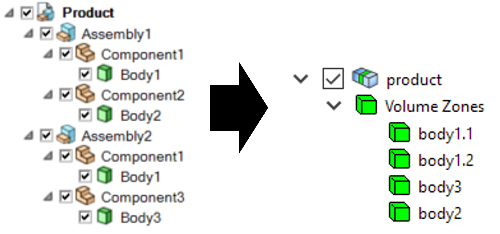
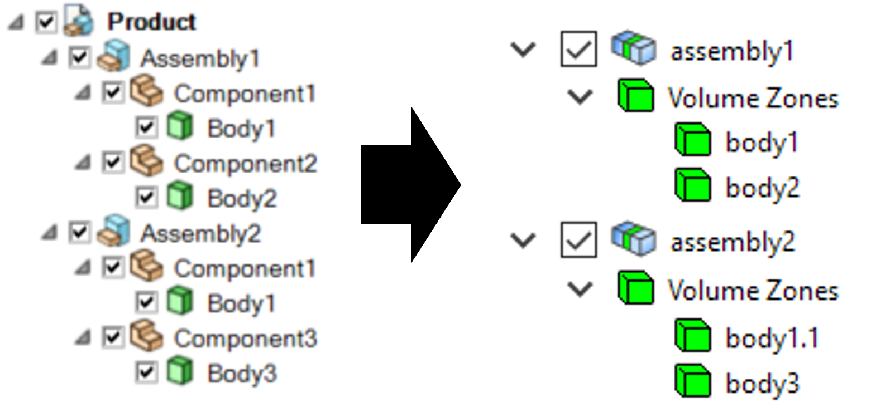
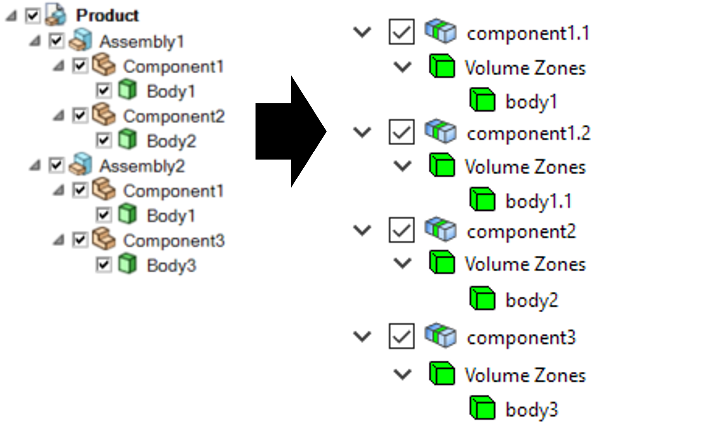
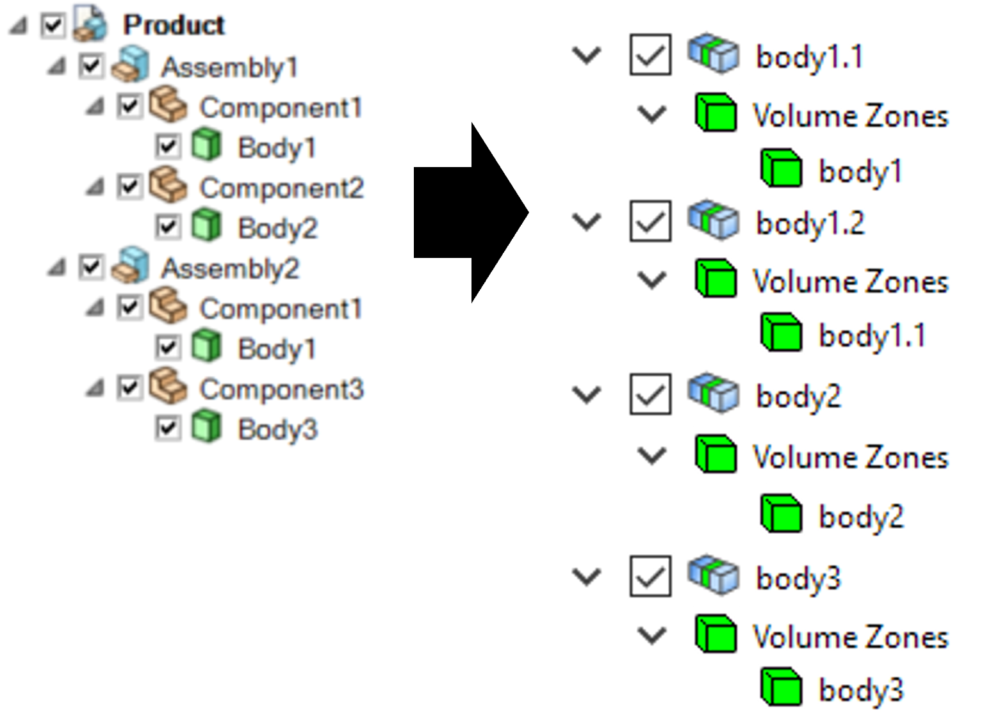

.. _ref_index_reading_writing:

*************************************
Reading and Writing Files in PyPrime 
*************************************

The :class:`FileIO <ansys.meshing.prime.FileIO>` class is used for all file based data exchanges.

PyPrime allows you to import and export different files. PyPrime supports the reading and writing of mesh files and size field files. 
PyPrime imports CAD files, Fluent meshing files and Prime database files. 
Also, exports Fluent meshing files with .msh,.CAS, .CDB extensions. You can save and write the files in PyPrime which can be used later. 

====================
Native PMDAT Format
====================

PMDAT is the native file format for Prime that contains all data associated with the active model.

This includes, geometry, mesh, topology, controls, labels and zones.

The model data can be read from and written to this format using :func:`FileIO.read_pmdat() <ansys.meshing.prime.FileIO.read_pmdat>` and
:func:`FileIO.write_pmdat() <ansys.meshing.prime.FileIO.write_pmdat>` with parameters defined in the
:class:`FileReadParams <ansys.meshing.prime.FileReadParams>` and :class:`FileWriteParams <ansys.meshing.prime.FileWriteParams>` classes respectively.

.. code:: python
    
    >>> from ansys.meshing import prime
    
    Start prime and get the model
    
    >>> prime_client = prime.launch_prime()
    >>> model = prime_client.model
    
    Download and read an example pmdat file
    
    >>> mixing_elbow = prime.examples.download_elbow_pmdat()
    >>> params = prime.FileReadParams(model=model)
    >>> prime.FileIO(model).read_pmdat(file_name=mixing_elbow, file_read_params=params)

==============
Importing CAD
==============

PyPrime supports importing CAD files and appending of CAD files in a model.
``FileIO.import_cad(filename,params)`` allows you to import the CAD files in PyPrime and set the options for importing the files.
This function also allows you to append a CAD model with an existing model. 
You may have to specify the import route for the CAD files depending on the imported files. 
CAD import routes available in PyPrime are Program Controlled, Native, SpaceClaim and Workbench. 

 * Program Controlled: Automatically choose the best route based on the CAD format. Program Controlled uses Native as available, SCDM for scdoc and Workbench for all the other formats.  
  
 * Native: Imports selected natively supported formats like FMD ``(*.fmd)``,ACIS ``(*.sat, *.sab)``, 
 Parasolid ``(*.x_t, *.x_b)``, JTOpen ``(*.jt, *.plmxml)``, STL ``(*.stl)``. 
 
 * SpaceClaim:  Uses SCDM to import supported CAD files from the SpaceClaim reader. Only Windows platform support the SpaceClaim file import.  
 
 * Workbench: Uses Workbench to import supported CAD files from the Workbench reader. 
 
 
When deploying scripts using SpaceClaim or Workbench CAD readers, ensure that the CAD configuration and in application defaults are consistent
in the deployed environment. 

Refer `CAD Support <https://www.ansys.com/it-solutions/platform-support>`_ document to view the CAD supported for Workbench route on different platforms. 

**Note**: You must install and configure Workbench CAD Readers/Plug-ins (Ansys Geometry Interfaces) while installing Ansys Workbench. 
 

Part Management and Creation
----------------------------

PyPrime has options for part management within the product structure while importing a CAD (Computer Aided Design) model. 
The CAD Model is the top in product hierarchy. A CAD Model can have one or more CAD assemblies. 
The CAD assembly or sub-assembly has different CAD parts.
The CAD part has bodies or other geometric entities. Typical CAD product structure is as follows: 

The ``PartCreationType`` class decides whether to create a part per:

 * Model

 * Assembly

 * Part 

 * Body

Model
^^^^^ 

When you import a CAD Model and specify Part Creation Type as Model, PyPrime creates a single part that inherits its name from the CAD Model name. 
The number of zones within the Part is identical to the number of bodies within the CAD Model. 

    **Part creation by Model (from SpaceClaim CAD structure to Prime part structure)**

Assembly 
^^^^^^^^^^^^^^^^^^^^^^^

When you import a CAD Model and specify Part Creation Type as Assembly, PyPrime creates a part
per CAD Assembly where the part name is inherited from the CAD Assembly name.
The number of zones within each part is identical to the number of bodies within the CAD Assembly.
Assembly is the default Part Creation Type. The structure of imported CAD Model in Pyprime looks as below: 

    **Part creation by Assembly (from SpaceClaim CAD structure to Prime part structure)**

Part 
^^^^

When you import a CAD Model and specify Part Creation Type as Part, PyPrime creates a part
per CAD Part that inherits the part name from the CAD Part name. 
The number of zones within a part is identical to the number of bodies within the CAD Part.
The structure of imported CAD Model with Part Creation Type as Part in Pyprime is as follows: 

    **Part creation by Part (from SpaceClaim CAD structure to Prime part structure)**

Body
^^^^

When you import a CAD Model and specify Part Creation Type as Body, PyPrime creates a part
per CAD Body that inherits the part name from the CAD Body name. The number of parts is identical to the number of bodies. 

    **Part creation by Body (from SpaceClaim CAD structure to Prime part structure)**
