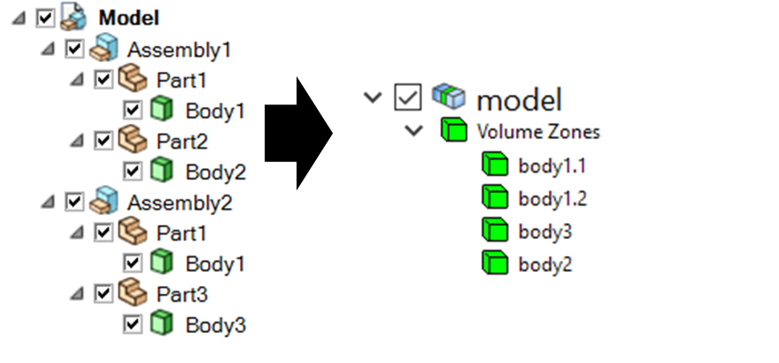
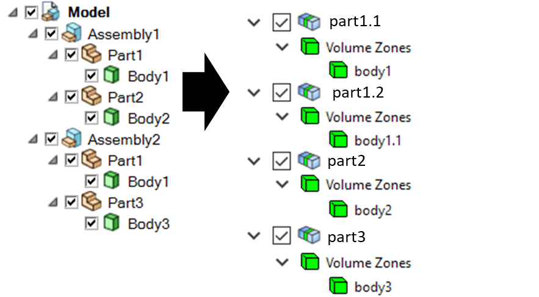
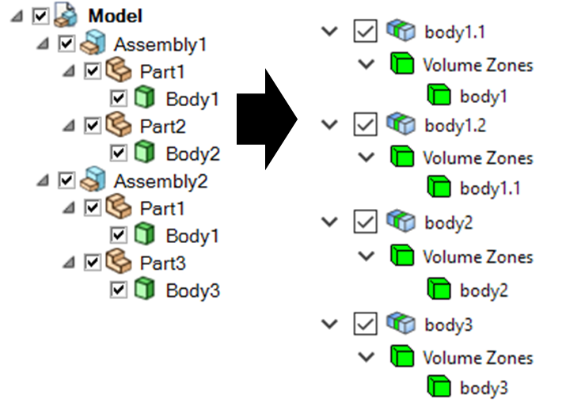

.. _ref_index_reading_writing:

**************************
Reading and Writing Files
**************************

The :class:`FileIO <ansys.meshing.prime.FileIO>` class is used for all file based data exchanges.

====================
Native PMDAT Format
====================

PMDAT is the native file format for PyPrime that contains all data associated with the active model.

This includes, geometry, mesh, topology, controls, labels and zones.

The model data can be read from and written to this format using the :func:`FileIO.read_pmdat() <ansys.meshing.prime.FileIO.read_pmdat>` and
:func:`FileIO.write_pmdat() <ansys.meshing.prime.FileIO.write_pmdat>` functions with parameters defined in the
:class:`FileReadParams <ansys.meshing.prime.FileReadParams>` and :class:`FileWriteParams <ansys.meshing.prime.FileWriteParams>` classes respectively.

.. code:: python
    
    >>> from ansys.meshing import prime
    
    Start prime and get the model
    
    >>> prime_client = prime.launch_prime()
    >>> model = prime_client.model
    
    Download and read an example pmdat file
    
    >>> mixing_elbow = prime.examples.download_elbow_pmdat()
    >>> params = prime.FileReadParams(model=model)
    >>> prime.FileIO(model).read_pmdat(file_name=mixing_elbow, file_read_params=params)

==============
Importing CAD
==============

The :func:`FileIO.import_cad() <ansys.meshing.prime.FileIO.import_cad>` function allows you to import CAD files and set parameters for importing files using the :class:`ImportCadParams <ansys.meshing.prime.ImportCadParams>` class.  

Appending CAD files
-------------------

The :attr:`ImportCadParams.append <ansys.meshing.prime.ImportCadParams.append>` attribute allows you to append a CAD file to the model. 

.. code:: python
    
    >>> params = prime.ImportCadParams(model=model, append=True)
    >>> prime.FileIO(model).import_cad(file_name="cad_to_append.scdoc", params=params)
     
CAD Reader Routes
-----------------

You may require to specify the import route for the CAD files using the :class:`CadReaderRoute <ansys.meshing.prime.CadReaderRoute>` class.

.. code:: python
    
    >>> params = prime.ImportCadParams(model=model, cad_reader_route=prime.CadReaderRoute.SPACECLAIM)
    >>> prime.FileIO(model).import_cad(file_name=mixing_elbow, params=params)

CAD import routes available in PyPrime are Program Controlled, Native, SpaceClaim and Workbench. 

 * Program Controlled: Automatically choose the best route based on the CAD format. Program Controlled uses Native as available, SCDM for scdoc and Workbench for all the other formats.  
  
 * Native: Imports selected natively supported formats like FMD ``(*.fmd)``,ACIS ``(*.sat, *.sab)``, Parasolid ``(*.x_t, *.x_b)``, JTOpen ``(*.jt, *.plmxml)``, STL ``(*.stl)``. 
 
 * SpaceClaim:  Uses SCDM to import supported CAD files from the SpaceClaim reader. Only Windows platform support the SpaceClaim file import.  
 
 * Workbench: Uses Workbench to import supported CAD files from the Workbench reader. 
 
Refer `CAD Support <https://www.ansys.com/it-solutions/platform-support>`_ document to view the CAD supported for Workbench route on different platforms. 

**Note**: When deploying scripts using SpaceClaim or Workbench CAD readers, ensure that the CAD configuration and in application defaults 
are consistent in the deployed environment. 

**Note**: You must install and configure Workbench CAD Readers/Plug-ins (Ansys Geometry Interfaces) while installing Ansys Workbench. 
 
Parametric CAD
--------------

Parametric CAD update can be used during import for CAD files that have parameters defined that can be accessed by the Workbench CAD readers.  

To get existing CAD parameters during import:

.. code:: python
    
    >>> params = prime.ImportCadParams(model=model)
    >>> params.cad_reader_route = prime.CadReaderRoute.WORKBENCH
    >>> result = prime.FileIO(model).import_cad(file_name="parametric_cad.scdoc", params=params)
    >>> print(result.cad_parameters)
    
    {'my_param': 1}
    
To set parameters to be used at import:

.. code:: python
    
    >>> params = prime.ImportCadParams(model=model)
    >>> params.cad_reader_route = prime.CadReaderRoute.WORKBENCH
    >>> params.cad_update_parameters = {'my_param': 2}
    >>> result = prime.FileIO(model).import_cad(file_name="parametric_cad.scdoc", params=params)
    >>> print(result.cad_parameters)
    
    {'my_param': 2}
   
Part Management and Creation
----------------------------

PyPrime has options for part management within the product structure while importing a CAD (Computer Aided Design) model. 
The CAD model is the top in product hierarchy. A CAD model can have one or more CAD assemblies. 
The CAD assembly or sub-assembly has different CAD parts.
The CAD part has bodies or other geometric entities. A typical CAD product structure is as follows: 

.. figure:: ../images/cad_structure.png
    :width: 96pt
    :align: center

    **Example CAD structure**

The :class:`PartCreationType <ansys.meshing.prime.PartCreationType>` class decides whether to create a part per:

 * Model

 * Assembly

 * Part 

 * Body

Model
^^^^^ 

When you import a CAD model and specify the :class:`PartCreationType <ansys.meshing.prime.PartCreationType>` attribute as :attr:`MODEL <ansys.meshing.prime.PartCreationType.MODEL>`, a single part is created that inherits its name from the CAD model name. 
The number of zones within the part is identical to the number of bodies within the CAD model.  As below:

    **Part creation by Model (from SpaceClaim CAD structure to Prime part structure)**

Assembly 
^^^^^^^^

When you import a CAD model and specify the :class:`PartCreationType <ansys.meshing.prime.PartCreationType>` attribute as :attr:`ASSEMBLY <ansys.meshing.prime.PartCreationType.ASSEMBLY>`, a part per CAD assembly is created where the part name is inherited from the CAD assembly name.
The number of zones within each part is identical to the number of bodies within the CAD assembly.  As below:

.. figure:: ../images/creation_assembly.png
    :width: 183pt
    :align: center

    **Part creation by Assembly (from SpaceClaim CAD structure to Prime part structure)**

Part 
^^^^

When you import a CAD model and specify the :class:`PartCreationType <ansys.meshing.prime.PartCreationType>` attribute as :attr:`PART <ansys.meshing.prime.PartCreationType.PART>`, a part per CAD part is created that inherits the part name from the CAD part name. 
The number of zones within a part is identical to the number of bodies within the CAD part.  As below:

    **Part creation by Part (from SpaceClaim CAD structure to Prime part structure)**

Body
^^^^

When you import a CAD model and specify the :class:`PartCreationType <ansys.meshing.prime.PartCreationType>` attribute as :attr:`BODY <ansys.meshing.prime.PartCreationType.BODY>`, a part per CAD body is created that inherits the part name from the CAD body name. 
The number of parts is identical to the number of bodies.  As below:

    **Part creation by Body (from SpaceClaim CAD structure to Prime part structure)**

==========================================
Importing and Exporting Solver Mesh Files
==========================================

To be added.

=====================================
Reading and Writing Size Field Files
=====================================

To be added.
