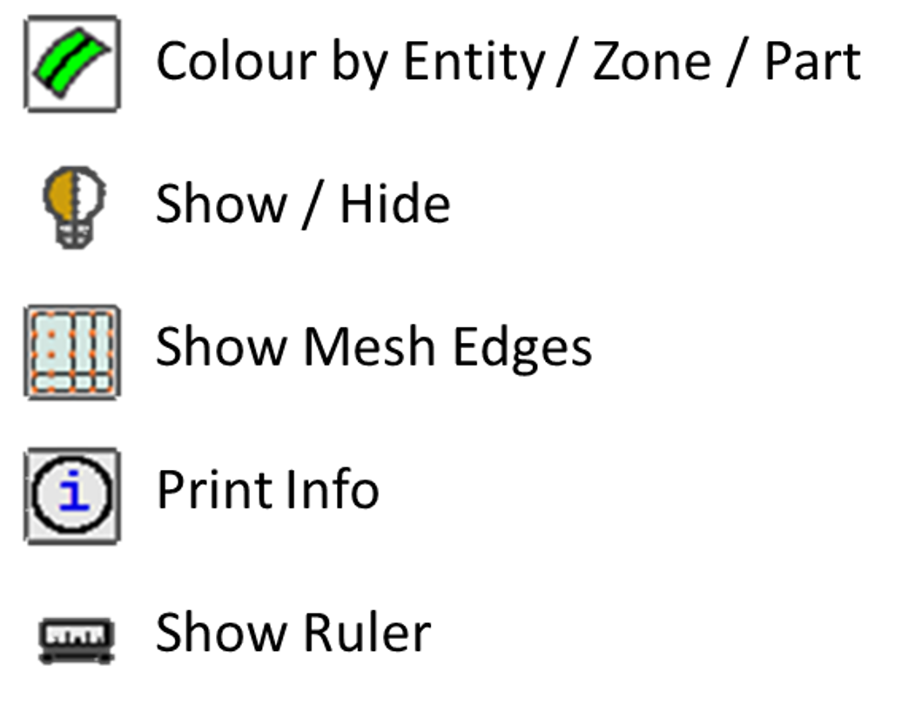

.. _ref_index_graphics:

**********************************
Interactive graphics using PyVista
**********************************
PyPrimeMesh provides support for interactive graphical visualisation using `PyVista <https://docs.pyvista.org/>`_
if this package is installed as a dependency.

This code shows how to display the model using the :class:`Graphics <ansys.meshing.prime.graphics>` class:

.. code-block:: pycon

    >>> from ansys.meshing.prime.graphics import PrimePlotter
    >>> import ansys.meshing.prime as prime
    >>> display = PrimePlotter()
    >>> display.plot(model)
    >>> display.show()

.. figure:: ../images/graphics.png
    :width: 400pt
    :align: center

    **Entire model displayed**

Using the :class:`ScopeDefinition <ansys.meshing.prime.ScopeDefinition>` class allows
you to limit the display to particular regions of the model:

.. code-block:: pycon

    >>> # display the first part only
    >>> display = PrimePlotter()
    >>> display.plot(
    ...     model, scope=prime.ScopeDefinition(model, part_expression=model.parts[0].name)
    ... )
    >>> display.show()

.. figure:: ../images/graphics_part.png
    :width: 400pt
    :align: center

    **Single part displayed**

Selections can be made of displayed objects. If selections in the window are made,
information about them can be printed to the console. Selections can also be hidden.

These graphics buttons are provided to help navigate the model and to
carry out basic verifications:

    **Graphics buttons**

Coloring the display
====================
The color button cycles through the ways entities can be colored. The mode can also be
set from a script with ``ColorByType``:

.. code-block:: pycon

    >>> from ansys.meshing.prime.core.mesh import ColorByType
    >>> display = PrimePlotter()
    >>> display.add_model(model)
    >>> display.set_color_by_type(ColorByType.CONNECTIVITY)
    >>> display.show()

``ZONE``, ``ZONELET``, and ``PART`` give each zone, entity, or part its own color from a
palette, which tells entities apart but carries no meaning beyond that.

``CONNECTIVITY`` instead colors entities by how they connect to the rest of their part,
which is the quickest way to spot leaks, missing interfaces, and unintended sheet bodies
before meshing. Faces are colored by the number of volumes they bound:

.. list-table::
    :header-rows: 1
    :widths: 20 80

    * - Class
      - Meaning
    * - ``SURFACE``
      - Bounds no volume, such as a sheet body.
    * - ``BODY``
      - Bounds exactly one volume, so it is the outer skin of a solid body.
    * - ``SHARED``
      - Bounds two or more volumes, so it is an interface inside the part.

Edges keep the connectivity colors they are always drawn with, so free, double, and
multiply connected edges stay distinguishable in every mode, including while a face is
selected. The exact colors are given by ``FACE_CONNECTIVITY_COLORS`` and
``TOPO_EDGE_TYPE_COLORS`` in ``ansys.meshing.prime.core.mesh``.

Face connectivity is read from the volumes of each part, so it works for topology parts
and for mesh parts alike, and for topology parts that have since been meshed. It is
resolved the first time you select the connectivity mode rather than at display time,
which keeps the cost off models that never use it.

Showing the mesh
================
The show mesh button toggles the interior edges of the displayed faces. What those edges
are depends on whether a face carries a mesh:

- A meshed face shows its element edges, drawn in the theme edge color. These are shown
  by default.
- An unmeshed face shows the facets that approximate its CAD surface, drawn faintly so
  that tessellation is not mistaken for a real mesh. These are hidden by default.

The two follow opposite sides of the same button, because facets stand in for a mesh
that is not there. A CAD model therefore arrives with clean surfaces and reveals its
tessellation only when you ask for it, while a meshed model shows its elements straight
away. In a partly meshed model the button swaps between the two, which shows at a glance
which faces have been meshed.
