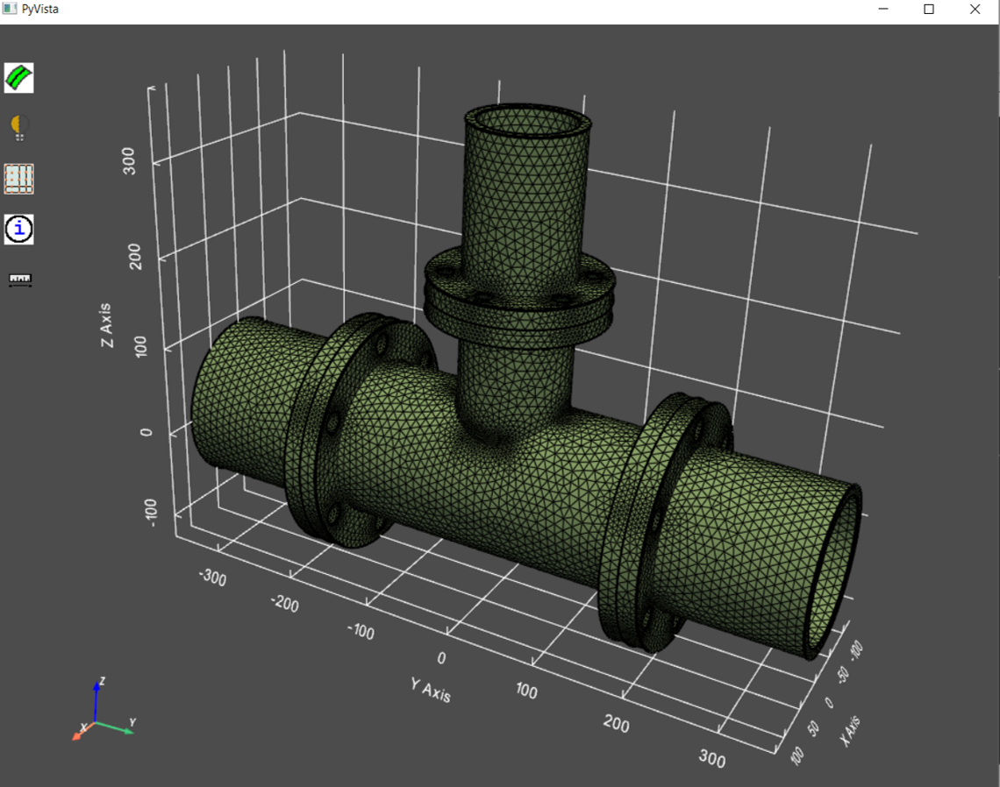
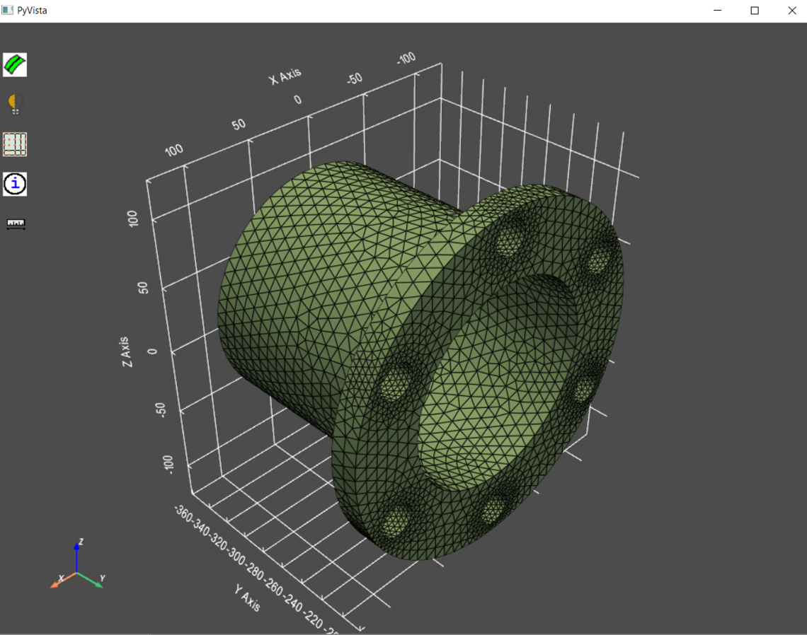
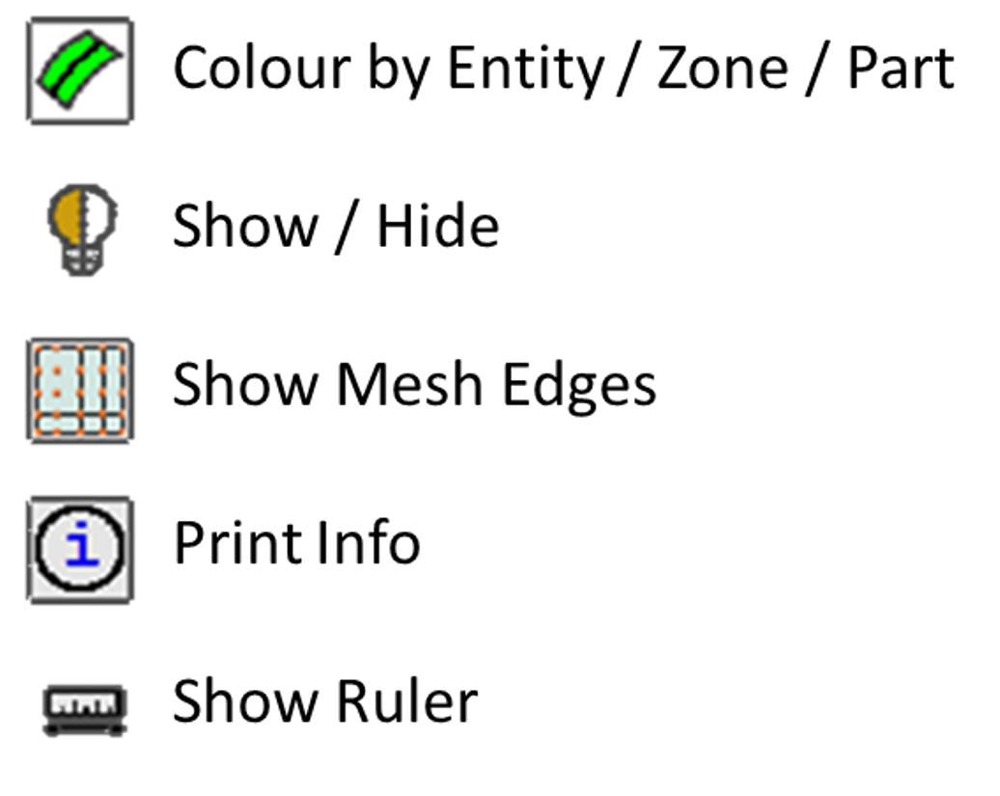

.. _ref_index_graphics:

**********************************
Interactive Graphics using PyVista
**********************************
PyPrimeMesh provides support for interactive graphical visualisation using `PyVista <https://docs.pyvista.org/>`_
if installed as a dependency.

The model can be displayed using the :class:`Graphics <ansys.meshing.prime.graphics>` class.

.. code:: python

    >>> from ansys.meshing.prime.graphics import Graphics
    >>> import ansys.meshing.prime as prime
    >>> display=Graphics(model)
    >>> display()

    **Entire model displayed**

Providing a :class:`ScopeDefinition <ansys.meshing.prime.ScopeDefinition>` will allow the display to be 
limited to particular regions of the model.

.. code:: python

    >>> # display the first part only
    >>> display(scope=prime.ScopeDefinition(model,part_expression=model.parts[0].name))

    **Single part displayed**

Selections can be made of displayed objects.  If selections in the window are made,
information can be printed about them to the console.  Selections can also be hidden.

Graphics functionality is provided to help navigate the model and to
carry out basic verifications.  These are:

    **Graphics buttons**
