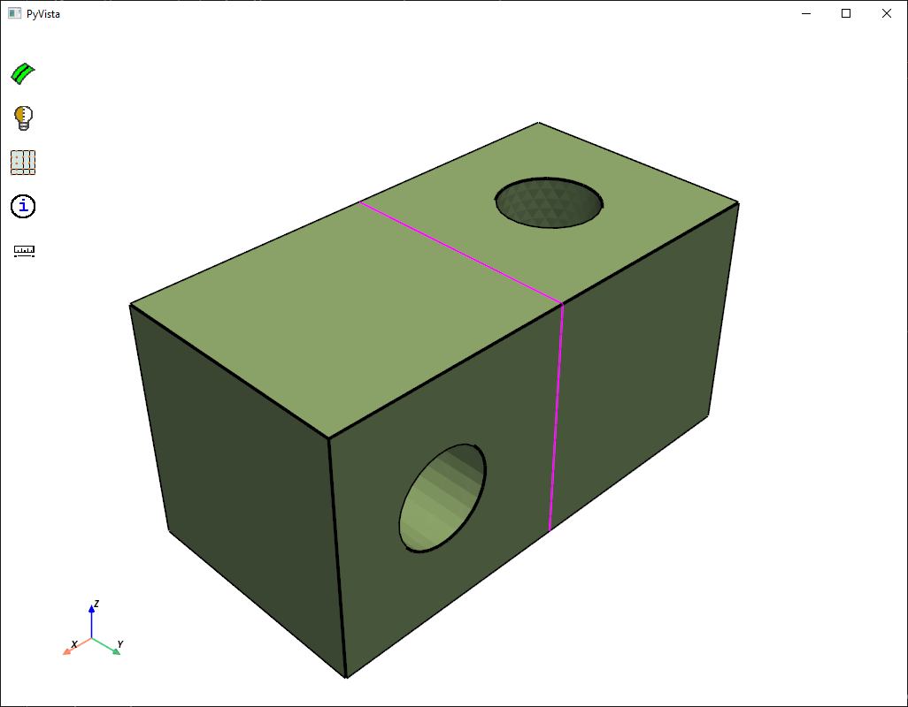
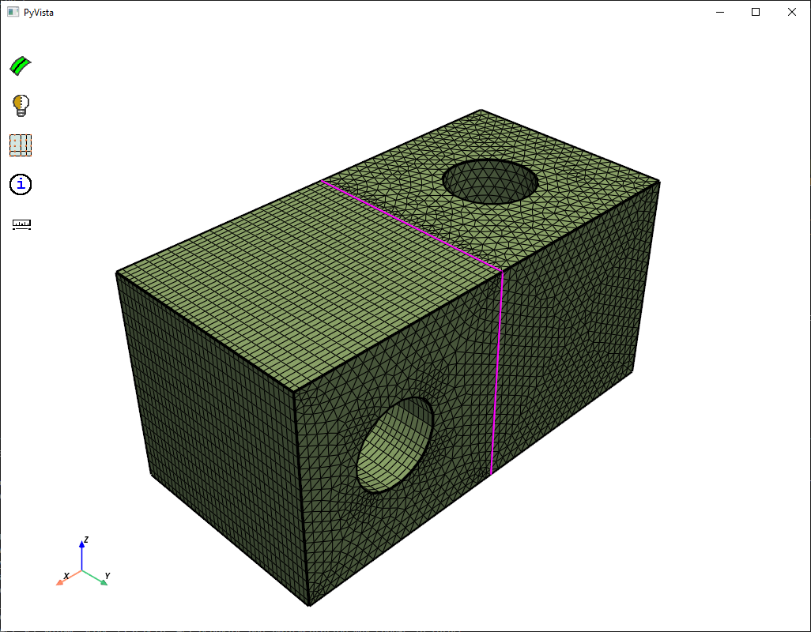

.. _ref_index_multizone:

==================
MultiZone controls
==================

*This is a Beta feature. API Behavior and Implementation  may change in future.*

:class:`MultiZoneControl <ansys.meshing.prime.MultiZoneControl>` class provides automatic decomposition of geometry into mapped (sweepable) regions and free regions. 
Mapped (sweepable) regions are filled with hexahedral elements and free regions are filled with non-hexahedral elements.
When you perform MultiZone Method meshing, all regions are meshed with a pure hexahedral mesh if possible.  

:class:`AutoMesh <ansys.meshing.prime.automesh>` class enables you to automatically create the hex mesh on the scoped bodies using multizone meshing algorithms. 
:func:`AutoMesh.mesh() <ansys.meshing.prime.AutoMesh.mesh>` method allows you to perform MultiZone meshing with given MultiZone control. 

The below example shows how MultiZone control can be applied on a body: 

1. Read the model.

.. code-block:: python

   file_io = prime.FileIO(model)
   res = file_io.read_pmdat(
       r"E:\Test\2Boxes_2Holes.pmdat", prime.FileReadParams(model=model)
   )
   print(model)

**Output:**

.. code-block:: pycon

   Part Summary:

   Part Name: zone2boxes_2holes
   Part ID: 2
    24 Topo Edges
    13 Topo Faces
    2 Topo Volumes

    0 Edge Zones
        Edge Zone Name(s) : []
    0 Face Zones
        Face Zone Name(s) : []
    2 Volume Zones
        Volume Zone Name(s) : [solid1, solid]

    2 Label(s)
        Names: [solid, solid1]

    Bounding box (-10 -10 0)
                 (30 10 20)

    error_code :  ErrorCode.NOERROR

2. Initialize the MultiZone control. MultiZone control sets the parameters and controls used for MultiZone meshing.  

.. code-block:: python

   multizone_control = model.control_data.create_multi_zone_control()

3. Define the volume scope and surface scope for the model to apply MultiZone control on the same.

.. code-block:: python

    MZVolParams = prime.ScopeDefinition(
        model=model,
        entity_type=prime.ScopeEntity.VOLUME,
        evaluation_type=prime.ScopeEvaluationType.ZONES,
        part_expression="*",
        label_expression="*",
        zone_expression="solid1",
    )

    multizone_control.set_volume_scope(MZVolParams)

    MZSurfParams = prime.ScopeDefinition(
        model=model,
        entity_type=prime.ScopeEntity.FACEZONELETS,
        evaluation_type=prime.ScopeEvaluationType.ZONES,
        part_expression="*",
        label_expression="*",
        zone_expression="*",
    )

    multizone_control.set_surface_scope(MZSurfParams)

4. Sets the MultiZone sizing parameters to initialize MultiZone sizing control parameters.

.. note::
   When you provide the sizefield, MultiZone consumes sizefield and impacts the MultiZone mesh. 

.. code-block:: python

 MZParams = prime.MultiZoneSizingParams(model)
 MZParams.max_size = params.max
 MZParams.min_size = params.min
 MZParams.growth_rate = params.growth_rate
 multizone_control.set_multi_zone_sizing_params(MZParams)
 print(MZParams)
 parts = model.parts
 autoMesher = prime.AutoMesh(model)
 autoMeshParams = prime.AutoMeshParams(model)
 autoMeshParams.multi_zone_control_ids = [multizone_control.id]

 for p in parts:
     result = autoMesher.mesh(p.id, autoMeshParams)
     print(result)

**Output:**

.. code-block:: pycon

    # This API set_multi_zone_sizing_params is a Beta. API Behavior and implementation may change in future.
    max_size :  1
    min_size :  0.039063
    growth_rate :  1.2
    use_volumetric_size_field :  False
    error_code :  ErrorCode.NOERROR
    warning_codes :  []
    error_locations :  []

.. figure:: ../images/multizone_meshing.png
    :width: 400pt
    :align: center

Some points to remember while performing MultiZone Meshing: 

* MultiZone Meshing supports only topology. 
* If the MultiZone meshing scopes only a few bodies of a multibody part, the remaining bodies of the part are auto meshed conformally.

* After creating the MultiZone control, you should specify its id in the automesh params for it to be considered for MultiZone meshing. 

* When you use the MultiZone mesh method in combination with other mesh methods in a multibody part, the bodies are meshed with conformally. 
  For example, in the model below, the multibody part meshes with the MultiZone Method and AutoMesh.

  .. figure:: ../images/multizone_automesh.png
    :width: 400pt
    :align: center

* Sometimes MultiZone is not automatically able to decompose a geometry into sweepable regions, though such decomposition may be possible. 
  For example, in the model below the MultiZone mesh produces free mesh.  

  .. figure:: ../images/multizone_freemeshpng.png
    :width: 400pt
    :align: center

* When you scope the source and target faces to MultiZone, MultiZone automates the geometry decomposition and generates the pure hex mesh 
  into sweepable regions to produce a purely hex mesh. In the below images, if the faces highlighted in green 
  color are scoped as source and target faces, MultiZone produces a purely hex mesh on the source and target faces.

  .. figure:: ../images/multizone_source_target.png
    :width: 400pt
    :align: center

