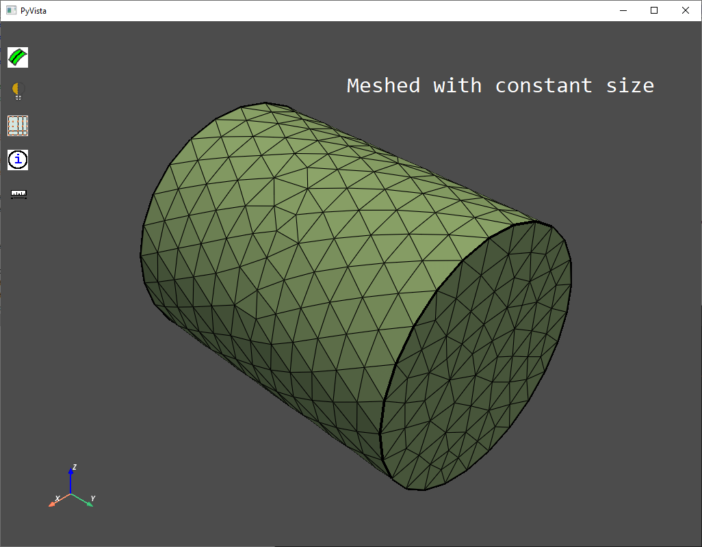
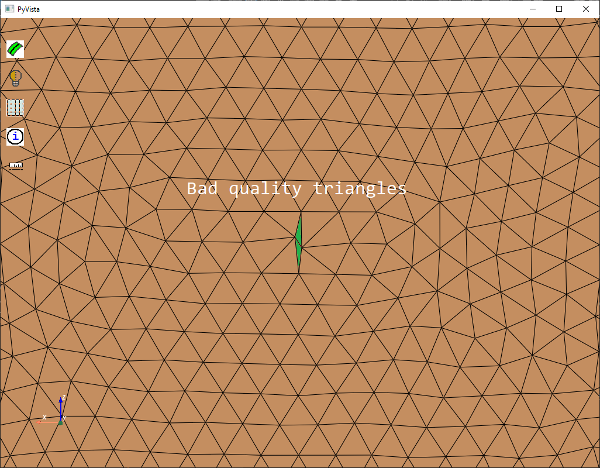

.. _ref_index_sizing:

******
Sizing
******

PyPrimeMesh provides various sizing controls to help you define how the mesh size is distributed on a surface or within the volume.

---------------
Sizing Control
---------------

When you mesh a model, you expect the mesh size to satisfy specific requirements at various locations in the model.
You must use optimal sizes while meshing to achieve resonable simulation accuracy at low computational cost.
PyPrimeMesh specifies the sizing requirements using sizing controls. The sizing controls in PyPrimeMesh have the following:

* Scope

* Maximum rate of change of size

* Range within which the sizes should be, on or within the scope

The :class:`SizingType <ansys.meshing.prime.SizingType>` has various control types to define sizing requirements:

 * Curvature

 * Proximity

 * Hard

 * Soft

 * Meshed

 * Body of Influence

Curvature Sizing
^^^^^^^^^^^^^^^^

When you select the :class:`SizingType <ansys.meshing.prime.SizingType>` attribute as :attr:`CURVATURE <ansys.meshing.prime.SizingType.CURVATURE>`, sizes on the scope are based on the local curvature, with the size being small when the local curvature is large and vice versa. The :class:`CurvatureSizingParams <ansys.meshing.prime.CurvatureSizingParams>` is used to specify following parameters: min/max size, growth rate and normal angle.

.. code:: python

    size_control = model.control_data.create_size_control(prime.SizingType.CURVATURE)
    size_control.set_curvature_sizing_params(
        prime.CurvatureSizingParams(
            model=model,
            min=0.2,
            max=2.0,
            normal_angle=18.0,
            growth_rate=1.2
        )
    )
    size_control.set_suggested_name("curv_control")
    size_control.set_scope(prime.ScopeDefinition(model=model))

.. figure:: ../images/curvaturesize.png
    :width: 400pt
    :align: center

The normal angle parameter is the maximum allowable angle that one element edge may span. For example, a value of 5 implies that a division are made when the angle change along the curve is 5 degrees. Hence, a 90 degree arc is divided into approximately 18 segments.

Proximity Sizing
^^^^^^^^^^^^^^^^

When you select the :class:`SizingType <ansys.meshing.prime.SizingType>` attribute as :attr:`PROXIMITY <ansys.meshing.prime.SizingType.PROXIMITY>`, sizes in gaps are set using the specified minimum number of element layers. Here, a gap is defined in one of two ways:

* The area between two opposing boundary edges of a face

* The internal volumetric region between two faces

The :class:`ProximitySizingParams <ansys.meshing.prime.ProximitySizingParams>` is used to specify following parameters: minsize, max size, growth rate and the number of element per gap.

.. code:: python

    size_control = model.control_data.create_size_control(prime.SizingType.PROXIMITY)
    size_control.set_proximity_sizing_params(
        prime.ProximitySizingParams(
            model=model,
            min=0.1,
            max=2.0,
            growth_rate=1.2,
            elements_per_gap=3.0
        )
    )
    size_control.set_suggested_name("prox_control")
    size_control.set_scope(prime.ScopeDefinition(model=model))
    
.. figure:: ../images/proximity.png
    :width: 400pt
    :align: center     
    
:attr:`ignore_self_proximity <ansys.meshing.prime.ProximitySizingParams.ignore_self_proximity> and :attr:`ignore_orientation <ansys.meshing.prime.ProximitySizingParams.ignore_orientation>` are also considered for Proximity Sizing. ignore_self_proximity is set to True if proximity between faces in the same face zonelet is to be ignored. ignore_orientation allows you to ignore the face normal orientation during the proximity calculation. This option is enabled by default. In general, the proximity depends on the direction of face normals. An example is shown below to explain the use of the ignore_orientation option for Face Proximity. The normals on the grooved box point inward. With default setting, the proximity size function does not refine the surface along the entire groove length. When the ignore_orientation is True, the surface will be refined along the groove length." 

Hard Sizing
^^^^^^^^^^^

When you select the :class:`SizingType <ansys.meshing.prime.SizingType>` attribute as :attr:`HARD <ansys.meshing.prime.SizingType.HARD>`, sizes on the scope are based on a uniform value while meshing. The :class:`HardSizingParams <ansys.meshing.prime.HardSizingParams>` is used to specify following parameters: minimum size and growth rate. 

Note: When you select Hard Sizing, it overrides all other specified size controls.

.. code:: python

    size_control = model.control_data.create_size_control(prime.SizingType.HARD)
    size_control.set_hard_sizing_params(
        prime.HardSizingParams(
            model=model,
            min=0.2,
            growth_rate=1.2
        )
    )
    size_control.set_suggested_name("hard_control")
    size_control.set_scope(prime.ScopeDefinition(model=model))

Soft Sizing
^^^^^^^^^^^

When you select the :class:`SizingType <ansys.meshing.prime.SizingType>` attribute as :attr:`SOFT <ansys.meshing.prime.SizingType.SOFT>`, sizes on the scope are based on a certain maximum value which should not exceed while meshing. The :class:`SoftSizingParams <ansys.meshing.prime.SoftSizingParams>` is used to specify following parameters: maximum size and growth rate.

When you select soft sizing for edges and/or faces, the other size controls affects the size. The minimum size on the zonelet is determined based on the influence of other size controls. Otherwise, a uniform size is maintained. A soft sizing is ignored in a region where other sizing controls specify smaller sizes.

.. code:: python

    size_control = model.control_data.create_size_control(prime.SizingType.SOFT)
    size_control.set_soft_sizing_params(
        prime.SoftSizingParams(
            model=model,
            max=0.2,
            growth_rate=1.2
        )
    )
    size_control.set_suggested_name("soft_control")
    size_control.set_scope(prime.ScopeDefinition(model=model))
    
.. figure:: ../images/softandhardsize.png
    :width: 400pt
    :align: center

Meshed Sizing
^^^^^^^^^^^^^

When you select the :class:`SizingType <ansys.meshing.prime.SizingType>` attribute as :attr:`MESHED <ansys.meshing.prime.SizingType.MESHED>`, sizes are based on existing local sizes. The :class:`MeshedSizingParams <ansys.meshing.prime.MeshedSizingParams>` class is used to specify growth rate.

.. code:: python

    size_control = model.control_data.create_size_control(prime.SizingType.MESHED)
    size_control.set_meshed_sizing_params(
        prime.MeshedSizingParams(
            model=model,
            growth_rate=1.2
        )
    )
    size_control.set_suggested_name("meshed_control")
    size_control.set_scope(prime.ScopeDefinition(model=model))
    

Body of Influence Sizing
^^^^^^^^^^^^^^^^^^^^^^^^

When you select the :class:`SizingType <ansys.meshing.prime.SizingType>` attribute as :attr:`BOI <ansys.meshing.prime.SizingType.BOI>`, sizes inside a closed volume scope should not cross a certain maximum value. The set of face zones selected to define the body of influence should form a geometrically closed region. If an open region is used as a body of influence, the sizing is processed as a soft sizing. The :class:`BoiSizingParams <ansys.meshing.prime.BoiSizingParams>` is used to specify following parameters: maximum size and growth rate.

.. code:: python

    size_control = model.control_data.create_size_control(prime.SizingType.BOI)
    size_control.set_boi_sizing_params(
        prime.BoiSizingParams(
            model=model,
            max=20.0,
            growth_rate=1.2
        )
    )
    size_control.set_suggested_name("BOI_control")
    size_control.set_scope(prime.ScopeDefinition(model=model))

.. figure:: ../images/boi.png
    :width: 400pt
    :align: center

-----------
Size Fields
-----------

Size fields are efficient representations of the size requirements that handle size-at-location. All surface and volume meshing functions in PyPrimeMesh work using size fields. The size field types available in PyPrimeMesh are: 

* Constant 

* Volumetric 

* Geodesic 

* Geometric 

* Meshedgeodesic 

Volumetric and  Geodesic Size fields can process and respect the size control you define. Volumetric size field can be computed using :attr:`Compute volumetric <ansys.meshing.prime.SizeField.compute_volumetric>` and then surface and volume meshing can be applied. The remaining size field types are computed as part of various surface and volume meshing operations.

Constant size field
^^^^^^^^^^^^^^^^^^^

When you select the :class:`SizeFieldType <ansys.meshing.prime.SizeFieldType>` attribute as :attr:`CONSTANT <ansys.meshing.prime.SizeFieldType.CONSTANT>`, size field is computed based on uniform sizing.

.. figure:: ../images/constantsize1.png
    :width: 400pt
    :align: center

Volumetric size field
^^^^^^^^^^^^^^^^^^^^^

When you select the :class:`SizeFieldType <ansys.meshing.prime.SizeFieldType>` attribute as :attr:`VOLUMETRIC <ansys.meshing.prime.SizeFieldType.VOLUMETRIC>`, size field is computed based on the size controls specified. 

Geodesic size field
^^^^^^^^^^^^^^^^^^^

When you select the :class:`SizeFieldType <ansys.meshing.prime.SizeFieldType>` attribute as :attr:`GEODESIC <ansys.meshing.prime.SizeFieldType.GEODESIC>`, size field is computed on face nodes based on the size controls specified. Sizes are defined along a surface rather than the volume. Geodesic sizing enables you to confine sizes to surfaces and avoid problems like dead space refinement.

  
.. figure:: ../images/meshgeodesicsize.png
    :width: 400pt
    :align: center

Geometric size field
^^^^^^^^^^^^^^^^^^^^

When you select the :class:`SizeFieldType <ansys.meshing.prime.SizeFieldType>` attribute as :attr:`GEOMETRIC <ansys.meshing.prime.SizeFieldType.GEOMETRIC>`, size field is computed based on the existing boundary sizes. Sizes can gradually increase from minimum size to maximum size based on the growth rate.

.. figure:: ../images/geometricsize.png
    :width: 400pt
    :align: center

Meshedgeodesic size field
^^^^^^^^^^^^^^^^^^^^^^^^^

When you select the :class:`SizeFieldType <ansys.meshing.prime.SizeFieldType>` attribute as :attr:`MESHEDGEODESIC <ansys.meshing.prime.SizeFieldType.MESHEDGEODESIC>`, size field is computed using average mesh edge lengths and is diffused geodesical.

    
.. figure:: ../images/meshedgeodesic1.png
    :width: 400pt
    :align: center
