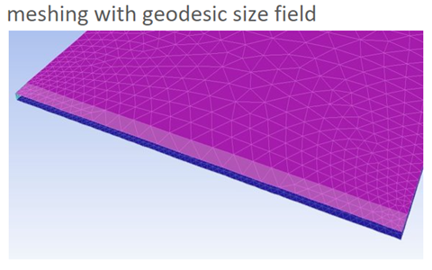
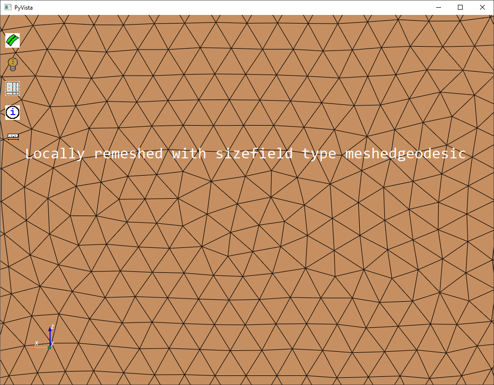

.. _ref_index_sizing:

******
Sizing
******

PyPrimeMesh provides various sizing controls to help you define how the mesh size is distributed on a surface or within the volume.

--------------
Sizing control
--------------

Mesh quality and resolution are important factors for capturing physics accurately and efficiently. Size controls allows you to get the desired mesh distribution.
PyPrimeMesh specifies the sizing requirements using sizing controls. The sizing controls in PyPrimeMesh have the following:

* Scope
* Maximum rate of change of size
* Range within which the sizes should be on or within the scope

The :class:`SizingType <ansys.meshing.prime.SizingType>` class has control types for defining sizing requirements:

* Curvature
* Proximity
* Hard
* Soft
* Meshed
* Body of influence

Curvature sizing
^^^^^^^^^^^^^^^^

In the :class:`SizingType <ansys.meshing.prime.SizingType>` class, selecting the :attr:`CURVATURE <ansys.meshing.prime.SizingType.CURVATURE>`
parameter sizes based on the scope on the local curvature. The size is small when the local curvature is large and vice versa.
This code shows how to use the :class:`CurvatureSizingParams <ansys.meshing.prime.CurvatureSizingParams>` class to specify
the minimum and maximum size, growth rate, and normal angle:

.. code-block:: python

    size_control = model.control_data.create_size_control(prime.SizingType.CURVATURE)
    size_control.set_curvature_sizing_params(
        prime.CurvatureSizingParams(model=model, min=0.2, max=2.0, growth_rate=1.2)
    )
    size_control.set_suggested_name("curv_control")
    size_control.set_scope(prime.ScopeDefinition(model=model))

The normal angle parameter is the maximum allowable angle that one element edge may span. For example, a value of 5 implies that a division are made when the angle change along the curve is 5 degrees. Hence, a 90 degree arc is divided into approximately 18 segments.

Proximity sizing
^^^^^^^^^^^^^^^^

In the :class:`SizingType <ansys.meshing.prime.SizingType>` class, selecting the
:attr:`PROXIMITY <ansys.meshing.prime.SizingType.PROXIMITY>` parameter sizes based on the closeness of
the surfaces or edges specified in the scope. This code shows how to use the
:class:`ProximitySizingParams <ansys.meshing.prime.ProximitySizingParams>` class to specify the
minimum and maximum size, growth rate, and the number of element per gap:

.. code-block:: python

    size_control = model.control_data.create_size_control(prime.SizingType.PROXIMITY)
    size_control.set_proximity_sizing_params(
        prime.ProximitySizingParams(
            model=model,
            min=0.1,
            max=2.0,
            growth_rate=1.2,
            elements_per_gap=3.0,
            ignore_orientation=True,
            ignore_self_proximity=False,
        )
    )
    size_control.set_suggested_name("prox_control")
    size_control.set_scope(prime.ScopeDefinition(model=model))

    
The :attr:`ignore_self_proximity <ansys.meshing.prime.ProximitySizingParams.ignore_self_proximity>`
and :attr:`ignore_orientation <ansys.meshing.prime.ProximitySizingParams.ignore_orientation>`
parameters are also considered for proximity sizing. The ``ignore_self_proximity`` parameter
is set to ``True`` if proximity between faces in the same face zonelet is to be ignored. The
``ignore_orientation`` parameter allows you to ignore the face normal orientation during the
proximity calculation. This Boolean parameter is set to ``False`` by default. In general,
the proximity depends on the direction of face normals.

This example explains the use of the ``ignore_orientation`` parameter for face proximity.
The normals on the grooved box point inward. With the default setting of ``False``, the 
proximity size function does not refine the surface along the entire groove length.
If the ``ignore_orientation`` is set to ``True``, the surface is refined along the groove length 

.. figure:: ../images/proximityorientation.png
    :width: 400pt
    :align: center  

Hard sizing
^^^^^^^^^^^

In the :class:`SizingType <ansys.meshing.prime.SizingType>` class, selecting the
:attr:`HARD <ansys.meshing.prime.SizingType.HARD>` parameter sizes on the scope based on a uniform
value while meshing. This code shows how to use the :class:`HardSizingParams <ansys.meshing.prime.HardSizingParams>`
class to specify the minimum size and growth rate:

.. code-block:: python

    size_control = model.control_data.create_size_control(prime.SizingType.HARD)
    size_control.set_hard_sizing_params(
        prime.HardSizingParams(model=model, min=0.2, growth_rate=1.2)
    )
    size_control.set_suggested_name("hard_control")
    size_control.set_scope(prime.ScopeDefinition(model=model))

Soft sizing
^^^^^^^^^^^

In the :class:`SizingType <ansys.meshing.prime.SizingType>` class, selecting the
:attr:`SOFT <ansys.meshing.prime.SizingType.SOFT>` parameter sizes on the scope based on a
certain maximum value that should not be exceeded while meshing. This code shows how
to use the :class:`SoftSizingParams <ansys.meshing.prime.SoftSizingParams>` class to specify
the maximum size and growth rate:

.. code-block:: python

    size_control = model.control_data.create_size_control(prime.SizingType.SOFT)
    size_control.set_soft_sizing_params(
        prime.SoftSizingParams(model=model, max=0.2, growth_rate=1.2)
    )
    size_control.set_suggested_name("soft_control")
    size_control.set_scope(prime.ScopeDefinition(model=model))

Meshed sizing
^^^^^^^^^^^^^

In the :class:`SizingType <ansys.meshing.prime.SizingType>` class, selecting the
:attr:`MESHED <ansys.meshing.prime.SizingType.MESHED>` parameter sizes based on existing local sizes.
This example shows how to use the :class:`MeshedSizingParams <ansys.meshing.prime.MeshedSizingParams>`
class to specify the growth rate:

.. code-block:: python

    size_control = model.control_data.create_size_control(prime.SizingType.MESHED)
    size_control.set_meshed_sizing_params(
        prime.MeshedSizingParams(model=model, growth_rate=1.2)
    )
    size_control.set_suggested_name("meshed_control")
    size_control.set_scope(prime.ScopeDefinition(model=model))
.. figure:: ../images/meshedsizing.png
    :width: 400pt
    :align: center

Body of influence sizing
^^^^^^^^^^^^^^^^^^^^^^^^

In the :class:`SizingType <ansys.meshing.prime.SizingType>` class, selecting the
:attr:`BOI <ansys.meshing.prime.SizingType.BOI>` parameter sizes inside a closed volume scope
that is not to exceed a certain maximum value. This code shows how to use the
:class:`BoiSizingParams <ansys.meshing.prime.BoiSizingParams>` class to specify the maximum size and growth rate:

.. code-block:: python

    size_control = model.control_data.create_size_control(prime.SizingType.BOI)
    size_control.set_boi_sizing_params(
        prime.BoiSizingParams(model=model, max=20.0, growth_rate=1.2)
    )
    size_control.set_suggested_name("BOI_control")
    size_control.set_scope(prime.ScopeDefinition(model=model))

.. figure:: ../images/boi.png
    :width: 400pt
    :align: center

-----------
Size fields
-----------

The :class:`SizeFieldType <ansys.meshing.prime.SizeFieldType>` class helps you to fetch the element size
at a given location. These size field types are available in PyPrimeMesh: 

* ``Constant``
* ``Volumetric``
* ``Geodesic``
* ``Geometric``
* ``Meshedgeodesic``

The ``Volumetric`` and  ``Geodesic`` size fields can process and respect the size control that you define.
The ``Volumetric`` size field can be computed using the :attr:`Compute volumetric <ansys.meshing.prime.SizeField.compute_volumetric>`
method and then surface and volume meshing can be applied. The remaining size field types are computed as
part of various surface and volume meshing operations.

Constant size field
^^^^^^^^^^^^^^^^^^^
  
In the :class:`SizeFieldType <ansys.meshing.prime.SizeFieldType>` class, selecting the
:attr:`CONSTANT <ansys.meshing.prime.SizeFieldType.CONSTANT>` parameter computes the size field
based on the size controls specified.

.. figure:: ../images/constantsize.png
    :width: 400pt
    :align: center

Volumetric size field
^^^^^^^^^^^^^^^^^^^^^

In the :class:`SizeFieldType <ansys.meshing.prime.SizeFieldType>` class, selecting the
:attr:`VOLUMETRIC <ansys.meshing.prime.SizeFieldType.VOLUMETRIC>` parameter computes the size field
based on the size controls specified.

Geodesic size field
^^^^^^^^^^^^^^^^^^^

In the :class:`SizeFieldType <ansys.meshing.prime.SizeFieldType>` class, selecting the
:attr:`GEODESIC <ansys.meshing.prime.SizeFieldType.GEODESIC>` parameter computes the size field
on face nodes based on the size controls specified. Sizes are defined along a surface rather than
the volume. Geodesic sizing enables you to confine sizes to surfaces and avoid problems like
dead space refinement.

.. figure:: ../images/meshvolumetricsize.png
    :width: 400pt
    :align: center
  

Geometric size field
^^^^^^^^^^^^^^^^^^^^
In the :class:`SizeFieldType <ansys.meshing.prime.SizeFieldType>` class, selecting the
:attr:`GEOMETRIC <ansys.meshing.prime.SizeFieldType.GEOMETRIC>` parameter computes the size field
based on existing boundary sizes. Sizes can gradually increase from the minimum size to the
maximum size based on the growth rate.

.. figure:: ../images/geometricsize.png
    :width: 400pt
    :align: center

Meshedgeodesic size field
^^^^^^^^^^^^^^^^^^^^^^^^^

In the :class:`SizeFieldType <ansys.meshing.prime.SizeFieldType>` class, selecting the
:attr:`MESHEDGEODESIC <ansys.meshing.prime.SizeFieldType.MESHEDGEODESIC>` parameter computes
the size field using average mesh edge lengths and is diffused geodesical.

.. figure:: ../images/meshedgeodesic.png
    :width: 400pt
    :align: center
    

