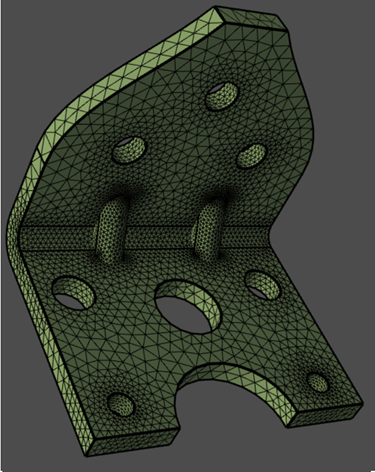

.. _ref_index_surfer:

***************
Surface Meshing
***************

PyPrime enables you to perform surface meshing using different surface meshing algorithms on topofaces or face zonelets.
``ansys.meshing.prime.Surfer(model, part_id)`` provides information on APIs used for surface meshing. 
Surface meshing considers many parameters like size field type, min size, max size, growth rate, transition type while meshing face zonelets or topofaces.

---------------------------------
Surface Meshing Geometry/Topology
---------------------------------

The following example shows you the procedure how to:

* Import topology-based geometry (.scdoc) and visualize the model
* Create curvature size control and compute volumetric size field
* Surface mesh the TopoFaces

.. image:: ../images/simple-bracket-holes_scdoc.png
    :align: center

.. code:: python

    >>> # Surface mesh with triangular elements
    >>> surfer_params = prime.SurferParams(model=model, size_field_type=prime.SizeFieldType.VOLUMETRIC)
    >>> surfer_result = prime.Surfer(model).mesh_topo_faces(
    >>>     part.id,
    >>>     topo_faces=part.get_topo_faces(),
    >>>     params=surfer_params
    >>> )

------------------
Remeshing Surfaces
------------------

The following example shows you the procedure how to:

* Import faceted geometry (.stl) and visualize the model
* Create curvature size control and compute volumetric size field
* Remesh the STL surface mesh
 
.. image:: ../images/simple-bracket-holes_stl.png
    :align: center

Firstly, start PyPrime and import the faceted geometry (.stl):

.. code:: python

    >>> import ansys.meshing.prime as prime
    >>> from ansys.meshing.prime.graphics import Graphics
  
    >>> prime_client = prime.launch_prime()
    >>> model = prime_client.model
  
    >>> # Import CAD file
    >>> input_file = r"D:/PyPrime/simple-bracket-holes.stl"
    >>> file_io = prime.FileIO(model)
    >>> file_io.import_cad(input_file, params=prime.ImportCadParams(model=model, length_unit=prime.LengthUnit.MM))

Once you imported the CAD file, you can display the model using graphics module and print the statistics on the model:

.. code:: python

    >>> # Show model in graphic and get part summary
    >>> display = Graphics(model)
    >>> display(update=True)
    >>> part = model.get_part_by_name('simple-bracket-holes')
    >>> part_summary_res = part.get_summary(prime.PartSummaryParams(model=model))
    >>> print(part_summary_res)

And set the global sizing parameters to initialize size control parameters (with curvature refinement):

    Visit :ref:`ref_index_controls` section for more information.

.. code:: python

    >>> # Surface mesh size controls
    >>> model.set_global_sizing_params(prime.GlobalSizingParams(model, min=0.27, max=5.5, growth_rate=1.2))
    >>> size_control = model.control_data.create_size_control(prime.SizingType.CURVATURE)
    >>> size_control.set_scope(prime.ScopeDefinition(model))

And compute the volumetric size field based on the size controls:

    Visit :ref:`ref_index_size_field` section for more information.

.. code:: python

    >>> size_field = prime.SizeField(model)
    >>> res = size_field_compute_volumetric(
    >>>     size_control_ids=[size_control.id],
    >>>     volumetric_sizefield_params=prime.VolumetricSizeFieldComputeParams(model, enable_multi_threading=False)
    >>> )

Finally, initialize surfer parameters and generate surface mesh on face zonelets:

.. code:: python

    >>> # Surface mesh with triangular elements
    >>> surfer_params = prime.SurferParams(model=model, size_field_type=prime.SizeFieldType.VOLUMETRIC)
    >>> surfer_result = prime.Surfer(model).remesh_face_zonelets(
    >>>     part_id=part.id,
    >>>     face_zonelets=part.get_face_zonelets(),
    >>>     edge_zonelets=part.get_edge_zonelets(),
    >>>     params=surfer_params
    >>> )
  
.. image:: ../images/simple-bracket-holes_mesh1.png
    :align: center

