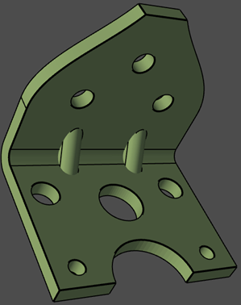
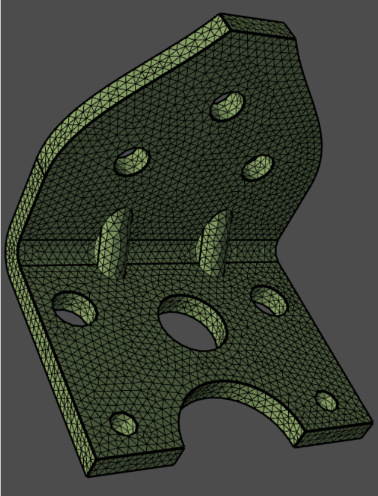
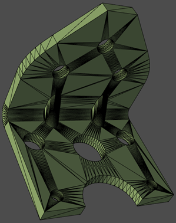

.. _ref_index_surfer:

***************
Surface Meshing
***************

The :class:`Surfer <ansys.meshing.prime.Surfer>` class enables you to perform surface meshing using
different surface meshing algorithms on topofaces or face zonelets.
Surface meshing considers many parameters like size field type, min size, max size, growth rate, transition type while meshing face zonelets or topofaces.

.. tip::
    Surface meshing with constant and variable sizing with tri/quad mesh can be generated using :func:`Mesh.surface_mesh() <ansys.meshing.prime.lucid.Mesh.surface_mesh>` in Lucid API.

=================================
Surface Meshing Geometry/Topology
=================================

The following example shows you the procedure to:

* Import topology-based geometry (.scdoc) and visualize the model
* Surface mesh the TopoFaces with constant size

Firstly, start PyPrimeMesh client and import the CAD geometry (.scdoc):

.. code:: python

    import ansys.meshing.prime as prime
    from ansys.meshing.prime.graphics import Graphics

    prime_client = prime.launch_prime()
    model = prime_client.model

    # Import CAD file
    input_file = r"D:/Examples/simple-bracket-holes.scdoc"
    file_io = prime.FileIO(model)
    file_io.import_cad(
        input_file,
        params=prime.ImportCadParams(model=model, length_unit=prime.LengthUnit.MM)
    )
    # Show model in graphic
    display = Graphics(model)
    display(update=True)
    part = model.get_part_by_name('simple-bracket-holes')

    **CAD geometry imported**

Initialize surfer parameters and generate surface mesh on TopoFaces:

.. code:: python

    # Surface mesh with triangular elements of uniform size
    surfer_params = prime.SurferParams(model=model, constant_size=1.0)
    surfer_result = prime.Surfer(model).mesh_topo_faces(
        part.id,
        topo_faces=part.get_topo_faces(),
        params=surfer_params
    )

    **Surface mesh displayed**

==================
Remeshing Surfaces
==================

The following example shows you the procedure to:

* Import faceted geometry (.stl) and visualize the model
* Create curvature size control and compute volumetric size field (visit :ref:`ref_index_sizing` section for more information.)
* Remesh the STL surface mesh

Firstly, start PyPrimeMesh client and import the faceted geometry (.stl):

.. code:: python

    import ansys.meshing.prime as prime
    from ansys.meshing.prime.graphics import Graphics

    prime_client = prime.launch_prime()
    model = prime_client.model

    # Import CAD file
    input_file = r"D:/Examples/simple-bracket-holes.stl"
    file_io = prime.FileIO(model)
    file_io.import_cad(input_file, params=prime.ImportCadParams(model=model, length_unit=prime.LengthUnit.MM))

After importing the CAD file, you can display the model using graphics module:

.. code:: python

    # Show model in graphic and get part summary
    display = Graphics(model)
    display(update=True)
    part = model.get_part_by_name('simple-bracket-holes')
    part_summary_res = part.get_summary(prime.PartSummaryParams(model=model))

    **Faceted geometry imported**

And print the results of part summary:

.. code:: python

    >>> print(part_summary_res)

    Part Name: simple-bracket-holes
    Part ID: 2
        0 Edge Zonelets
        1 Face Zonelets
        0 Cell Zonelets

        0 Edge Zones
            Edge Zone Name(s) : []
        0 Face Zones
            Face Zone Name(s) : []
        0 Volume Zones
            Volume Zone Name(s) : []

        0 Label(s)
            Names: []

        Bounding box (-10 -10 -8.17)
                     (19.1 23.075 25.52)

        Mesh Summary:
            1048 Nodes
            0 Poly Faces
            0 Quad Faces
            2124 Tri Faces
            2124 Faces
            0 Cells

And set the global sizing parameters to initialize size control parameters (with curvature refinement):

.. code:: python

    # Surface mesh size controls
    model.set_global_sizing_params(prime.GlobalSizingParams(model, min=0.27, max=5.5, growth_rate=1.2))
    size_control = model.control_data.create_size_control(prime.SizingType.CURVATURE)
    size_control.set_scope(prime.ScopeDefinition(model))

And compute the volumetric size field based on the size controls:

.. code:: python

    size_field = prime.SizeField(model)
    res = size_field_compute_volumetric(
        size_control_ids=[size_control.id],
        volumetric_sizefield_params=prime.VolumetricSizeFieldComputeParams(model, enable_multi_threading=False)
    )

Finally, initialize surfer parameters and generate surface mesh on face zonelets:

.. code:: python

    # Surface mesh with triangular elements
    surfer_params = prime.SurferParams(model=model, size_field_type=prime.SizeFieldType.VOLUMETRIC)
    surfer_result = prime.Surfer(model).remesh_face_zonelets(
        part_id=part.id,
        face_zonelets=part.get_face_zonelets(),
        edge_zonelets=part.get_edge_zonelets(),
        params=surfer_params
    )

.. figure:: ../images/simple-bracket-holes_mesh1.png
    :width: 300pt
    :align: center

    **Surface mesh displayed**

Remeshing surface using Lucid class
------------------------------------

The following example shows you the method required to replicate the surface mesh results as shown above:

.. code:: python

    import ansys.meshing.prime as prime
    prime_client = prime.launch_prime()
    model = prime_client.model

    # Instantiate the lucid class
    mesh_util = prime.lucid.Mesh(model)

    # Import CAD file (.stl)
    input_file = r"D:/Examples/simple-bracket-holes.stl"
    mesh_util.read(input_file)

    # Surface mesh the geometry with curvature sizing
    # Set min and max sizing that will be used for curvature refinement
    mesh_util.surface_mesh(min_size=0.27, max_size=5.5)

